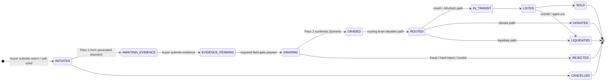

# Item Lifecycle State Machine

Inset diagram — include this as a callout box on the architecture diagram.

## Who owns each transition

| Transition | Module |
|---|---|
| `INITIATED → AWAITING_EVIDENCE` | `grading/` — Pass 1 form kicks off |
| `AWAITING_EVIDENCE → EVIDENCE_PENDING` | `items/` — evidence submitted |
| `EVIDENCE_PENDING → GRADING` | `grading/` — required-field gate passed |
| `GRADING → GRADED` | `grading/` — Pass 2 synthesis complete |
| `GRADING → REJECTED` | `grading/` — fraud preflight HARD signal |
| `GRADED → ROUTED` | `routing/` — disposition decision made |
| `ROUTED → IN_TRANSIT` | `routing/` — resell/refurbish path chosen |
| `ROUTED → DONATED / LIQUIDATED` | `routing/` — alt paths |
| `IN_TRANSIT → LISTED` | `resale/` — draft listing published |
| `LISTED → SOLD` | `orders/` — buyer purchases |
