# SecondLife — Reference Architecture (AWS-Flow Style)

Laid out to mirror the reference image: a horizontal main flow on top
(Clients → Auth → API → Grading Pipeline), a zoomed routing "detail flow" in the
middle, cross-cutting services on the left, and data/external/legend at the bottom.

Render in VS Code Mermaid Preview, [mermaid.live](https://mermaid.live), or GitHub.

```mermaid
flowchart LR

  %% ===== TOP ROW: main synchronous flow =====
  subgraph CLIENTS["CLIENTS · React + Vite"]
    direction TB
    C1["Buyer Web App"]
    C2["Seller Dashboard"]
    C3["Admin Panel"]
  end

  subgraph AUTH["CLERK AUTH · User Authentication"]
    direction TB
    A1["✔ Validates JWT session"]
    A2["✔ Role: buyer / seller / admin"]
    A3["✔ Attaches req.user"]
  end

  subgraph EXP["EXPRESS API · Main Entry Point :5001"]
    direction TB
    E1["✔ Request routing"]
    E2["✔ Validation + error mw"]
    E3["✔ Orchestrates ML calls"]
  end

  subgraph GRADE["AI GRADING PIPELINE · FastAPI :8000"]
    direction LR
    G1["INSTANCE 1\nPASS 1: Form Generator\n(Gemini)"]
    G2["INSTANCE 2\nFraud Preflight\n(phash + EXIF · no LLM)"]
    G3["INSTANCE 3\nVideo Frame Selector\n(OpenCV · CPU-only)"]
    G4["INSTANCE 4\nField Inspector\n(Gemini · per field)"]
    G5["PASS 2\nGrade Synthesizer\n(Gemini → Grade A–D)"]
  end

  CLIENTS -->|"① login"| AUTH --> EXP
  EXP -->|"② orchestrate"| GRADE
  G2 -.->|preflight| G4
  G3 -.->|frames| G4
  G4 --> G5

  %% ===== MIDDLE LANE: routing detail flow =====
  subgraph ROUTE["DISPOSITION ROUTING (Routing Brain) — DETAIL FLOW"]
    direction LR
    R1["INPUTS\nGrade · Trust · Demand"]
    R2["TAG & MATCH\nGemini tags + $geoNear"]
    R3["ROUTING DECISION\n6-path scorecard\n+ hard gates"]
    R4["ACTION ENGINE\ndraft listing · best warehouse\n· refund timing"]
    R5["OUTPUTS\nResale PDP · Donate · Liquidate\nPeer · Return-to-seller"]
    R1 --> R2 --> R3 --> R4 --> R5
  end

  G5 -->|"③ Grade JSON"| R1

  %% ===== LEFT: cross-cutting services =====
  subgraph SHARED["CROSS-CUTTING SERVICES"]
    direction TB
    S1["TRUST ENGINE"]
    S2["PREVENTION (RIKB + fit hint)"]
    S3["FESTIVE DEFENCE"]
    S4["SUSTAINABILITY"]
    S5["DEVELOPER LOGS"]
  end
  SHARED <-->|read / write| EXP
  S2 -.->|PDP fit hint| CLIENTS

  %% ===== BOTTOM: data + external =====
  subgraph DATA["DATA STORES"]
    direction TB
    D1[("MongoDB Atlas M0")]
    D2[("AWS S3 · ap-south-1")]
  end

  subgraph EXTAI["EXTERNAL AI / VISION"]
    direction TB
    X1["Google Gemini\nflash / flash-lite"]
    X2["AWS Rekognition"]
    X3["AWS Textract"]
  end

  C1 -.->|"presigned PUT (direct)"| D2
  GRADE -.->|LLM calls| X1
  G2 -.-> X2
  G2 -.-> X3
  R3 --> D1
  G5 --> D1
  EXP --> D1

  %% ===== LEGEND =====
  subgraph LEGEND["LEGEND"]
    direction TB
    L1["→  Synchronous Flow"]
    L2["⇢  External Service Call"]
    L3["✔  Key Function"]
  end

  %% ===== STYLES =====
  classDef clients fill:#f1f5f9,stroke:#64748b,color:#0f172a
  classDef auth    fill:#ede9fe,stroke:#8b5cf6,color:#2e1065
  classDef api     fill:#dcfce7,stroke:#22c55e,color:#14532d
  classDef ml      fill:#fae8ff,stroke:#d946ef,color:#4a044e
  classDef route   fill:#dbeafe,stroke:#3b82f6,color:#1e3a5f
  classDef shared  fill:#fee2e2,stroke:#ef4444,color:#7f1d1d
  classDef data    fill:#f1f5f9,stroke:#475569,color:#0f172a
  classDef ext     fill:#fef9c3,stroke:#eab308,color:#713f12
  classDef legend  fill:#ffffff,stroke:#94a3b8,color:#334155

  class CLIENTS,C1,C2,C3 clients
  class AUTH,A1,A2,A3 auth
  class EXP,E1,E2,E3 api
  class GRADE,G1,G2,G3,G4,G5 ml
  class ROUTE,R1,R2,R3,R4,R5 route
  class SHARED,S1,S2,S3,S4,S5 shared
  class DATA,D1,D2 data
  class EXTAI,X1,X2,X3 ext
  class LEGEND,L1,L2,L3 legend
```

