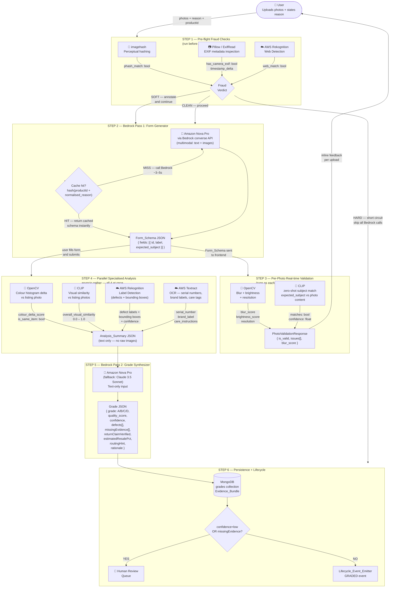

# Phase 2 — AI Grading Pipeline

## Implementation Plan (Detailed)

> Goal: Implement the v1.43 hybrid grading pipeline end-to-end — the technical centerpiece.
> End state: a user uploading photos gets back an objective Grade JSON in ~10–20 seconds, persisted
> with full provenance, with a `GRADED` lifecycle event emitted.

---

## Parallel-Work Constraint (Read this first)

Phase 1 (Dual-Intake Entry Points) is being built **simultaneously on a separate branch**. To avoid
major merge conflicts:

| Phase 2 OWNS | Phase 2 MUST NOT TOUCH |
|---|---|
| `backend/src/modules/grading/` | `items` collection / schema |
| `ml-service/app/` (grading + vision pipeline) | `returns` / `secondhand` modules |
| `grades` collection | item lifecycle **state machine** |
| Pass-1/Pass-2 prompt files | lifecycle **event writer** (consume via interface only) |

**Integration contract (input to grading):**
```
// REST endpoint (for standalone testing / future use):
POST /api/grading/trigger
{ itemId, userId, productId, reason, imageUrls[], intakePath, category }

// Direct service call (Phase 1 → Phase 2, the merge-contract):
const { triggerGrading } = require('../grading/grading.service');
await triggerGrading(itemId, { evidencePhotos, category, originalProductId });
// evidencePhotos = array of S3 URL strings
// originalProductId = the catalog product ID
```

**⚠️ Teammate's exact instructions:**
- `grading.service.js` MUST export `triggerGrading(itemId, { evidencePhotos, category, originalProductId })`
- Do NOT touch `returns/`, `secondhand/`, `items/` folders

**Lifecycle boundary (output):** emit a `GRADED` event through a thin `Lifecycle_Event_Emitter`
interface/stub. Phase 1 owns the real writer. Coordinate the interface signature, don't conflict on
the file.

---

## Current State (What We Have — from Phase 0)

**Backend (`backend/src/modules/grading/`) — SCAFFOLDED:**
- `grading.model.js` — `Grade` schema already matches v1.43 contract (itemId, grade A/B/C/D,
  qualityScore, confidence, defects[], missingEvidence[], returnClaimVerified, estimatedResalePct,
  routingHint, rationale, modelVersions).
- `grading.service.js` — `triggerGrading` / `getGradeByItemId` / `getGradeById` stubs with TODOs.
- `grading.controller.js` — returns 501.
- `grading.routes.js` — `POST /trigger`, `GET /:itemId`, `GET /health`.
- `grading.validation.js` — stub.

**Contracts (`backend/src/contracts/`) — COMMITTED:**
- `grade.contract.js` — `GRADES`, `CONFIDENCE_LEVELS`, `DEFECT_SEVERITIES`, `ROUTING_HINTS`,
  `GRADE_TO_CONDITION_LANE`.
- `lifecycleEvent.contract.js` — `EVENT_TYPES` (incl. `GRADED`, `EVIDENCE_SUBMITTED`), `ACTOR_ROLES`.

**Uploads:** S3 pre-signed upload utility exists (`backend/src/modules/uploads/`). Images go to S3;
tools receive S3 URLs.

**ML Service (`ml-service/app/`) — SKELETON:**
- `main.py` — routers wired (`/grade`, `/vision`, `/predict`, `/health`).
- `config.py` — pydantic settings (AWS + Bedrock model IDs).
- `routers/grading.py` — `POST /grade/` → `NotImplementedError`.
- `routers/vision.py` — `/vision/validate-photo`, `/vision/analyze-image` → `NotImplementedError`.
- `models/schemas.py` — `GradingRequest`, `GradingResponse`, `PhotoValidationRequest/Response` defined.
- `services/bedrock.py` — `BedrockService.invoke` w/ fallback (⚠️ Anthropic-style body — needs Nova
  `converse` support).
- `services/rekognition.py` — `detect_labels`, `detect_moderation_labels`.
- `services/textract.py` — `extract_text`.
- `services/opencv_utils.py` — blur/brightness/resolution checks **IMPLEMENTED**.
- `services/clip_service.py` — `CLIPService` stubs → `NotImplementedError`.
- `requirements.txt` — fastapi, boto3, Pillow, opencv-python-headless, numpy, imagehash, pydantic.
  CLIP (torch/transformers) **NOT yet** present.

---

## Task Breakdown

### Task 2.1 — Bedrock Client: add Nova `converse` support

**What:** Upgrade `services/bedrock.py` to support Amazon Nova Pro via the `converse` API (multimodal
text+image) while keeping the Claude fallback. The current body is Anthropic-style only.

**Steps:**
1. Add a `converse(messages, model_id, max_tokens, temperature)` path using `client.converse(...)`.
2. Branch request body by model family (Nova `converse` vs Anthropic `invoke_model`).
3. Keep automatic fallback to `bedrock_model_fallback` on primary failure.
4. Add a JSON-extraction helper that strips any prose and parses the first valid JSON object.
5. Add a thin `invoke_json(prompt, images=None)` returning parsed JSON or raising a typed error.

**Output:** A Bedrock wrapper usable by both passes, multimodal-ready, with deterministic JSON output.

---

### Task 2.2 — CLIP service implementation + dependencies

**What:** Implement `services/clip_service.py` zero-shot subject match and visual similarity.

**Steps:**
1. Add `torch`, `transformers` to `requirements.txt` (pin versions; CPU build is fine for demo).
2. Lazy-load `openai/clip-vit-base-patch32` on first use; cache the model in module scope.
3. `subject_match(image_url, expected_subject) -> { matches: bool, confidence: float }`.
4. `visual_similarity(image_url, listing_image_urls[]) -> float` (cosine similarity, max/avg).
5. Fetch image bytes from S3 URL; handle fetch failures gracefully.

**Output:** Working CLIP subject-match + similarity, no training, runs on CPU.

---

### Task 2.3 — Pre-flight fraud checks

**What:** New `services/fraud_preflight.py` running three cheap signals before any LLM call.

**Steps:**
1. **imagehash** — perceptual hash of each submitted photo vs pre-computed catalog hashes; Hamming
   distance ≤ threshold (~10) = match.
2. **Pillow/EXIF** — presence of camera metadata (make/model/timestamp). Absent = weak signal.
3. **Rekognition** web/label signal via existing `rekognition.py`.
4. Classify outcome: `HARD` (short-circuit) vs `SOFT` (annotate, continue).
5. Return `{ phash_match, exif_has_camera_data, rekognition_web_match, classification }`.

**Output:** Fraud verdict consumed by the orchestrator; hard signal skips both Bedrock passes.

---

### Task 2.4 — Prompt architecture (base + per-category)

**What:** Create the prompt files and a loader.

**Steps:**
1. `ml-service/app/prompts/base_prompt.txt` — grading rubric + "return only valid JSON".
2. `ml-service/app/prompts/categories/{category}.txt` — per-category overlays (apparel, electronics,
   footwear to start).
3. `prompts/pass1_form_generation.txt`, `prompts/pass2_grade_synthesis.txt` templates.
4. A `prompt_loader.py` that composes base + category (+ fall back to base alone if no category file).

**Output:** Consistent, configurable prompt injection for both passes.

---

### Task 2.5 — Bedrock Pass 1: Form Generator + cache

**What:** Implement form-schema generation with caching.

**Steps:**
1. `services/form_generator.py` — compose prompt (reason + initial photos + listing data + base +
   category), call Bedrock `invoke_json`, validate against Form_Schema shape.
2. Cache key = `hash(productId + normalized_reason)` (lowercase, trim, collapse whitespace).
3. In-memory TTL cache (`GRADE_CACHE_TTL_SECONDS`); cache hit skips Bedrock.
4. On invalid/failed Bedrock output → generic default Form_Schema fallback.

**Output:** `POST /grade/form` (or equivalent) returning a Form_Schema, cached and deterministic.

---

### Task 2.6 — Per-photo validation endpoint

**What:** Implement `routers/vision.py` `validate-photo`.

**Steps:**
1. Wire OpenCV blur/lighting/resolution checks (already implemented in `opencv_utils.py`).
2. Optional CLIP subject match when `expected_subject` is provided.
3. Populate `PhotoValidationResponse` (`is_valid`, `issues[]`, `blur_score`, `brightness_score`).
4. Return `is_valid: false` + specific `issues` on any failed check.

**Output:** Real-time inline photo feedback before form submit.

---

### Task 2.7 — Parallel specialized analysis + summary assembly

**What:** Implement `services/analysis_orchestrator.py` (the step-8 fan-out).

**Steps:**
1. `asyncio.gather` over: OpenCV color+histogram delta vs listing; CLIP visual similarity;
   Rekognition label detection (defects w/ confidence+location); Textract OCR (serials/labels/tags).
2. Per-task try/except — a failed task becomes a warning in the summary, others proceed.
3. Assemble one structured `Analysis_Summary` JSON (mirror the v1.43 intermediate-summary shape).
4. Merge in the fraud-preflight outcome and any soft signals.

**Output:** A single text summary, the sole input to Pass 2.

---

### Task 2.8 — Bedrock Pass 2: Grade Synthesizer

**What:** Implement `services/grade_synthesizer.py`.

**Steps:**
1. Send Analysis_Summary **text only** (no raw images) + base + category prompts to Bedrock.
2. Parse to canonical Grade JSON; enforce enums (grade, confidence, routingHint) and numeric bounds.
3. Set `missingEvidence` from insufficient-evidence fields; downgrade `confidence` accordingly.
4. Populate `model_versions` (pass1Model, pass2Model, rekognitionVersion).
5. Wire `routers/grading.py` `POST /grade/` to run the full pipeline and return `GradingResponse`.

**Output:** Canonical, schema-valid Grade JSON from the FastAPI service.

---

### Task 2.9 — Backend orchestration in `grading.service.js`

**What:** Implement the Express side that ties intake → ML service → persistence → lifecycle.

**Steps:**
1. `grading.validation.js` — validate the Grading_Request_Contract (all fields, non-empty
   `imageUrls`).
2. `triggerGrading(payload)` — call ML_Service `/grade` at `ML_SERVICE_URL`; handle non-200/unreachable.
3. Persist Grade + Evidence_Bundle (prompts, S3 URLs, summary, Pass-1 schema, model versions, timestamps).
4. `getGradeByItemId` / `getGradeById` — implement reads; 404 when absent.
5. Thin controller + Standard_Response envelope on every path.

**Output:** Working `POST /api/grading/trigger`, `GET /api/grading/:itemId`, `GET /api/grading/health`.

---

### Task 2.10 — Human-review escalation + lifecycle emission

**What:** Flagging logic and the Phase 1 boundary.

**Steps:**
1. After persistence: if `confidence === 'low'` OR `missingEvidence.length > 0` → set
   `flaggedForReview = true`, withhold the auto-routing trigger.
2. Expose a query for flagged grades (seller/admin dashboard).
3. `Lifecycle_Event_Emitter` interface/stub — on success & not flagged, emit `GRADED` (using
   `EVENT_TYPES.GRADED`). If emitter unavailable → grade persists, mark emission `pending`.

**Output:** Uncertain grades flagged; `GRADED` emitted via interface without owning the writer.

---

### Task 2.11 — Progressive form rendering API

**What:** Backend support for instant generic fields → AI fields swap.

**Steps:**
1. Form-readiness state per item (`pending` vs `ready`).
2. Generic field set returned immediately; AI Form_Schema returned once Pass 1 completes.
3. Endpoint the frontend can poll / subscribe to for readiness.

**Output:** No-spinner progressive form behavior backed by the API.

---

### Task 2.12 — Graceful degradation wiring

**What:** Ensure every external dependency has a fallback.

**Steps:**
1. Bedrock primary fail → fallback model (Task 2.1).
2. Bedrock down at Pass 1 → cached schema, else generic default schema.
3. Rekognition down → summary warning + grade-with-warning.
4. Irrecoverable failure → failure Standard_Response, no partial grade persisted as final.

**Output:** Pipeline degrades instead of hard-failing.

---

### Task 2.13 — Property-based & integration tests

**What:** Encode the correctness properties from the spec.

**Steps (PBT — pure/in-memory logic, mock AWS):**
1. Grade schema validity — every produced grade validates against the model/contract.
2. Grade domain — enums + numeric bounds always hold.
3. Low-confidence/missing-evidence → always flagged, auto-route withheld.
4. Hard fraud → both Bedrock passes skipped.
5. Pass-1 cache determinism — identical (productId, normalized reason) ⇒ identical key, cache hit.
6. Form_Schema parse→print→parse round-trip.
7. Trigger validation rejects malformed payloads (HTTP 400).
8. Partial-analysis-failure resilience — summary still assembled with warning.

**Steps (integration — 1–3 examples, real or recorded):**
- One end-to-end run per persona (Priya→C, Rahul→B, Anjali→A) on representative photos.

**Output:** Property tests for logic, a few integration smoke tests for the wired pipeline.

---

## Execution Order & Dependencies

```
Task 2.1 (Bedrock Nova converse) ─┐
Task 2.2 (CLIP impl + deps)       ─┤
Task 2.3 (Fraud preflight)        ─┼─► Task 2.7 (Parallel analysis) ─► Task 2.8 (Pass 2)
Task 2.4 (Prompt architecture)    ─┘            │
        │                                       │
        └─► Task 2.5 (Pass 1 + cache)           │
                    │                           │
                    └─► Task 2.6 (Photo validate)│
                                                 ▼
Task 2.9 (Backend orchestration) ─► Task 2.10 (Escalation + lifecycle)
        │                                   │
        └─► Task 2.11 (Progressive form)    │
                                            ▼
Task 2.12 (Degradation) ─► Task 2.13 (Tests)
```

**Critical path:** 2.1 → 2.4 → 2.5 → 2.7 → 2.8 → 2.9 → 2.10 → 2.13

**Parallelizable:**
- 2.1, 2.2, 2.3, 2.4 can all start immediately (independent ML-service pieces).
- 2.11 (progressive form) can run alongside 2.9.
- Prompt files (2.4) have no code dependency — write early.

---

## Estimated Time

| Task | Time | Who |
|---|---|---|
| 2.1 Bedrock Nova `converse` | 1.5 hr | Python dev |
| 2.2 CLIP impl + deps | 2.5 hr | Python/ML dev |
| 2.3 Fraud preflight | 1.5 hr | Python dev |
| 2.4 Prompt architecture | 1 hr | Anyone (prompt-savvy) |
| 2.5 Pass 1 form generator + cache | 2 hr | Python dev |
| 2.6 Per-photo validation endpoint | 1 hr | Python dev (OpenCV done) |
| 2.7 Parallel analysis + summary | 2.5 hr | Python dev |
| 2.8 Pass 2 grade synthesizer | 2 hr | Python dev |
| 2.9 Backend orchestration | 2 hr | Backend dev |
| 2.10 Escalation + lifecycle emit | 1 hr | Backend dev |
| 2.11 Progressive form API | 1 hr | Backend dev |
| 2.12 Graceful degradation wiring | 1.5 hr | Both |
| 2.13 PBT + integration tests | 2.5 hr | Both |

**Total (sequential):** ~22 hours
**Total (parallelized, ML dev + backend dev):** ~10–12 hours

---

## Definition of Done

When ALL of the following are true, Phase 2 is complete:

1. ✅ `POST /api/grading/trigger` accepts the integration contract
   `{ itemId, userId, productId, reason, imageUrls[], intakePath, category }`, validates all inputs,
   and returns the Standard_Response envelope.
2. ✅ Pre-flight fraud checks run before any Bedrock call; a hard signal short-circuits both passes.
3. ✅ Bedrock Pass 1 generates a Form_Schema; identical `(productId, normalized reason)` hits the
   cache and skips Bedrock.
4. ✅ `POST /vision/validate-photo` returns blur/lighting/resolution + optional CLIP subject match
   with specific `issues`.
5. ✅ Form submit fans out OpenCV + CLIP + Rekognition + Textract via `asyncio.gather` into one
   structured Analysis_Summary; one tool failing produces a warning, not a crash.
6. ✅ Bedrock Pass 2 produces a canonical Grade JSON (text-only input, no raw images) that validates
   against `grade.contract.js` and the `grades` model — `grade ∈ {A,B,C,D}`, enums + bounds enforced.
7. ✅ Full Evidence_Bundle (prompts, S3 URLs, summary, Pass-1 schema, grade, model versions,
   timestamps) persisted in the `grades` collection keyed by `itemId`.
8. ✅ Low-confidence or non-empty `missingEvidence` grades are flagged for human review and
   auto-routing is withheld; flagged grades are queryable for a dashboard.
9. ✅ A `GRADED` lifecycle event is emitted through the `Lifecycle_Event_Emitter` interface/stub —
   Phase 2 never writes the lifecycle collection directly.
10. ✅ Graceful degradation verified: Bedrock fallback model, cached/generic schema when Bedrock is
    down, grade-with-warning when Rekognition is down.
11. ✅ Form returns an initial response < 5s; full grade returns ~10–20s under normal conditions.
12. ✅ Property-based tests pass for the correctness properties; persona integration runs produce
    Priya→C, Rahul→B, Anjali→A.
13. ✅ No changes made to the `items` collection, `returns`/`secondhand` modules, or the lifecycle
    state machine — Phase 1 branch merges cleanly.

---

## Model & Tool Reference — What Each Tool Does and Why

> This section explains every model and tool in the pipeline: what it receives, what it returns,
> why it exists, and critically — why it can't be replaced by another tool already in the pipeline.
> Read this when you're confused about overlap (e.g. "why imagehash AND CLIP AND Rekognition?").

---

### The Short Answer to "Why So Many Tools?"

Each tool detects a **different attack vector or quality signal**. They look at images but they
measure completely different things:

| Fraud / Quality Problem | Tool That Catches It |
|---|---|
| User re-submits our own catalog photo | `imagehash` — exact/near-match against our DB |
| User grabs a random image from Google | Rekognition **web detection** — matches public internet |
| Photo is blurry / too dark to grade | OpenCV **blur + brightness** check |
| User photographs the wrong part of the item | CLIP **subject match** (validation) |
| User submits a different product entirely | CLIP **visual similarity** (analysis) |
| User submits a different colour/variant | OpenCV **colour histogram delta** |
| Serial number doesn't match the order | Textract **OCR** + DB lookup |
| Specific defects exist on the item | Rekognition **label detection** — named defects + locations |
| Photo taken before the item was delivered | Pillow **EXIF timestamp** anomaly |
| Photo has no camera metadata (downloaded) | Pillow **EXIF** — absence of make/model |

The pre-flight three (`imagehash`, EXIF, Rekognition web) are cheap gatekeepers — run them first
so you never pay for Bedrock on obvious fraud. The step-4 four run in parallel on genuine
submissions. Pass 2 Nova Pro is the only thing that synthesises across all of them.

---

### Full Pipeline Diagram



---

### Tool-by-Tool Reference

#### imagehash — Perceptual Hashing

**Step:** Pre-flight (Step 1)
**Library:** `imagehash` (Python)
**Cost:** ~0ms, zero API calls, pure math

| | |
|---|---|
| **Input** | Submitted photo (pixel data) + pre-computed hash library of all catalog/listing images |
| **How** | Converts each image to a 64-bit fingerprint based on visual structure. Measures Hamming distance between the submitted photo and every catalog hash. Distance ≤ 10 = match. |
| **Output** | `{ phash_match: bool, matched_catalog_id: str \| null }` |
| **Catches** | Stock-photo theft: user grabs the product's own listing photo and submits it as "proof of condition" |
| **Cannot catch** | A photo-of-a-photo (re-photographed on a second screen) — the hash changes. That's what OpenCV and EXIF catch. |

---

#### Pillow / ExifRead — EXIF Metadata Inspection

**Step:** Pre-flight (Step 1)
**Library:** `Pillow` (Python)
**Cost:** ~0ms, zero API calls

| | |
|---|---|
| **Input** | Raw image file (JPEG/PNG) |
| **How** | Reads the metadata block baked into the image file by the camera/phone at capture time. |
| **Output** | `{ has_camera_exif: bool, make, model, timestamp, gps_location, timestamp_vs_delivery_delta_hours }` |
| **Catches** | Downloaded/stock images have NO EXIF. Real phone photos do. Also catches temporal anomalies: photo taken 3 months before purchase, or 4 hours after delivery on a category that needs use to evaluate. |
| **Limitation** | EXIF can be stripped by WhatsApp/messaging apps. Absence is a **soft signal**, not proof of fraud. |

---

#### AWS Rekognition — Web Detection *(pre-flight use)*

**Step:** Pre-flight (Step 1)
**API:** `detect_web_pages` / `search_by_image`
**Cost:** ~$0.001/image

| | |
|---|---|
| **Input** | S3 URL of the submitted photo |
| **How** | Checks whether this exact image (or a near-duplicate) appears anywhere on the public internet. |
| **Output** | `{ web_match_found: bool, matched_urls[], similarity_score }` |
| **Catches** | Any image from anywhere on the internet — Google Images, Amazon listings, brand websites. Complements `imagehash` which only checks against our own catalog. |
| **Note** | This is a **completely different Rekognition API call** from Step 4. Same service, different function. |

---

#### OpenCV — Blur + Brightness + Resolution *(validation use)*

**Step:** Per-photo validation (Step 3)
**Library:** `opencv-python-headless`
**Cost:** ~0ms, zero API calls

| | |
|---|---|
| **Input** | Single uploaded image (pixel matrix) |
| **How** | Laplacian variance → blur score. Histogram → average brightness. Image dimensions → resolution check. |
| **Output** | `{ is_valid: bool, blur_score, brightness_score, issues: ["too_blurry", "too_dark", "too_low_res"] }` |
| **Purpose** | Reject bad photos before submission so the user can retake them. Pass 2 Bedrock cannot grade what it cannot see. A blurry defect looks clean to an LLM. |
| **Cannot do** | Understand what is in the photo — only checks technical quality. |

---

#### CLIP — Zero-Shot Subject Match *(validation use)*

**Step:** Per-photo validation (Step 3)
**Model:** `openai/clip-vit-base-patch32` (CPU, no training)
**Cost:** ~100ms CPU inference

| | |
|---|---|
| **Input** | Uploaded photo + `expected_subject` string from the Form_Schema (e.g. `"the sole of a shoe"`) |
| **How** | Encodes both the image and text description into the same embedding space. Cosine similarity tells you whether the photo content matches the text description. |
| **Output** | `{ matches: bool, confidence: float }` |
| **Purpose** | "Did the user photograph the right part of the item?" OpenCV checks image **quality**. CLIP checks image **content**. A crisp photo of a ceiling passes OpenCV but fails CLIP when we asked for a shoe sole. |

> **CLIP appears twice in the pipeline with different jobs:**
> - Step 3 validation: *"Did you photo the RIGHT PART we asked for?"*
> - Step 4 analysis: *"Is this the SAME PRODUCT as the listing?"*

---

#### OpenCV — Colour Histogram Delta *(analysis use)*

**Step:** Parallel analysis (Step 4)
**Library:** `opencv-python-headless`
**Cost:** ~0ms, zero API calls

| | |
|---|---|
| **Input** | Submitted evidence photos + original catalog listing photo |
| **How** | Extracts dominant colour palette from both images. Computes histogram difference between them. |
| **Output** | `{ dominant_color_submitted, dominant_color_listing, color_delta_score, is_same_item: bool }` |
| **Catches** | Item-swap fraud: user bought a red dress, is returning a blue one. Colour delta above threshold = wrong item. |
| **Difference from CLIP** | CLIP checks semantic similarity ("is this a dress?"). OpenCV checks pixel-level colour match. Both can pass or fail independently. |

---

#### CLIP — Visual Similarity *(analysis use)*

**Step:** Parallel analysis (Step 4)
**Model:** `openai/clip-vit-base-patch32`
**Cost:** ~100ms CPU inference

| | |
|---|---|
| **Input** | All submitted evidence photos + all original catalog listing photos |
| **How** | Encodes all images into embedding space. Cosine similarity between submitted set and catalog set. Returns max or average across the photo set. |
| **Output** | `{ overall_visual_similarity: float }` e.g. `0.91` = almost certainly same product, `0.41` = likely wrong item or heavily damaged |
| **Purpose** | Semantic identity check. OpenCV colour can pass even if the item is the right colour but a totally different product. CLIP understands "this is a baby monitor" vs "this is a shoe." |

---

#### AWS Rekognition — Label Detection *(analysis use)*

**Step:** Parallel analysis (Step 4)
**API:** `detect_labels`
**Cost:** ~$0.001/image

| | |
|---|---|
| **Input** | All evidence photos (S3 URLs) |
| **How** | Deep CNN trained on millions of images. Detects objects, attributes, and damage indicators with bounding boxes and confidence scores. |
| **Output** | `{ labels: [{ name, confidence, bounding_box }] }` e.g. `"Tear" 94%`, `"Stain" 87%`, `"Broken" 91%` |
| **Purpose** | The **defect detector**. CLIP and OpenCV give you similarity scores. Rekognition gives you **named defects with locations**. This is what drives Grade B vs Grade C. No other tool in this pipeline can do this. |
| **Note** | This is a **completely different Rekognition API call** from Step 1. Same service, different function. |

> **Rekognition appears twice in the pipeline with different API calls:**
> - Step 1 pre-flight: web detection (stock photo check)
> - Step 4 analysis: label detection (defect identification)

---

#### AWS Textract — OCR

**Step:** Parallel analysis (Step 4)
**API:** `detect_document_text` / `analyze_document`
**Cost:** ~$0.0015/page

| | |
|---|---|
| **Input** | Evidence photos — especially serial number, brand label, care tag photos |
| **How** | Document + text detection model trained specifically for structured text extraction from images. |
| **Output** | `{ extracted_text: str, serial_number: str \| null, brand_label: str, care_instructions: str }` |
| **Purpose** | Verifies the **identity** of the item, not just its appearance. Serial number from photo = serial number in our DB? Brand label matches the catalog? Wrong serial = item-swap fraud. No other tool in this pipeline can read text. |

---

#### Amazon Nova Pro — Bedrock Pass 1: Form Generator

**Step:** Pass 1 (Step 2)
**API:** Bedrock `converse` (multimodal)
**Cost:** ~$0.01–0.05 per call (cached aggressively)

| | |
|---|---|
| **Input** | User's stated return reason (text) + 1–2 initial photos (multimodal) + original product listing data + `base_prompt.txt` + `{category}.txt` overlay |
| **How** | LLM reasons over the product, category, and reason to generate exactly the evidence fields and photos needed for an objective grade. |
| **Output** | `Form_Schema JSON` — `{ fields: [{ id, label, type, required, expected_subject }] }` e.g. for shoes: `sole_photo`, `upper_photo`, `size_label_photo`; for DSLR: `sensor_photo`, `serial_number_photo`, `all_ports` |
| **Purpose** | A generic "upload 3 photos" form misses critical evidence. An electronics return needs serial number photos. A shoe return needs sole photos. The LLM knows what matters per category. |
| **Cache** | Key = `hash(productId + normalised_reason)`. Same SKU + same reason = zero Bedrock call. Cuts cost ~70%. |

---

#### Amazon Nova Pro / Claude 3.5 Sonnet — Bedrock Pass 2: Grade Synthesizer

**Step:** Pass 2 (Step 5)
**API:** Bedrock `converse` (text only)
**Cost:** ~$0.02–0.10 per call

| | |
|---|---|
| **Input** | `Analysis_Summary` text only (no raw images — keeps Pass 2 cheap) + `base_prompt.txt` + `{category}.txt` + pre-flight fraud signals |
| **How** | LLM reads the assembled summary (e.g. "CLIP similarity 0.91, Rekognition found Tear@94% on upper-left, serial matches, no EXIF, colour delta 0.03") and applies the grading rubric to produce a verdict. |
| **Output** | Canonical `Grade JSON` — `{ grade, quality_score, confidence, defects[], missingEvidence[], returnClaimVerified, estimatedResalePct, routingHint, rationale }` |
| **Purpose** | No single vision tool can synthesise across all signals into a human-readable grade with a rationale. The LLM is the **orchestrator that weighs all evidence and writes the verdict**. It does not "see" — the other tools do the seeing. It judges. |
| **Why text-only** | Pass 1 already paid for image understanding. Sending raw images again to Pass 2 costs ~3–5× more per Bedrock call for no additional signal — the Analysis_Summary already captures everything the images told us. |


## TODOs:
- [ ] Let seller customize the AI Grader (custom prompt)
- [ ] Base Prompt, Category Prompt, Custom Prompt (seller side)