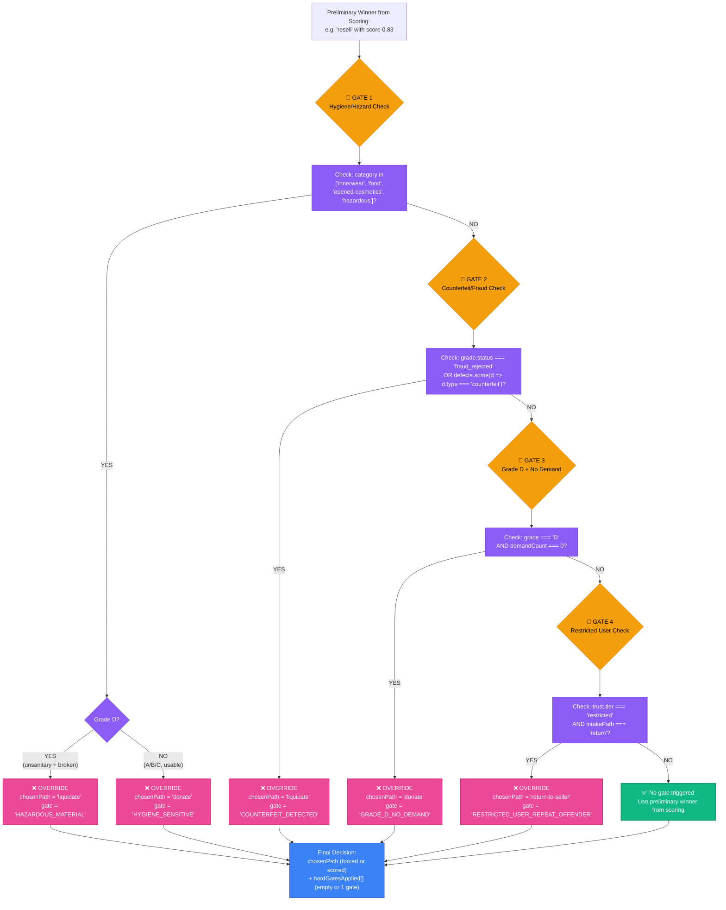
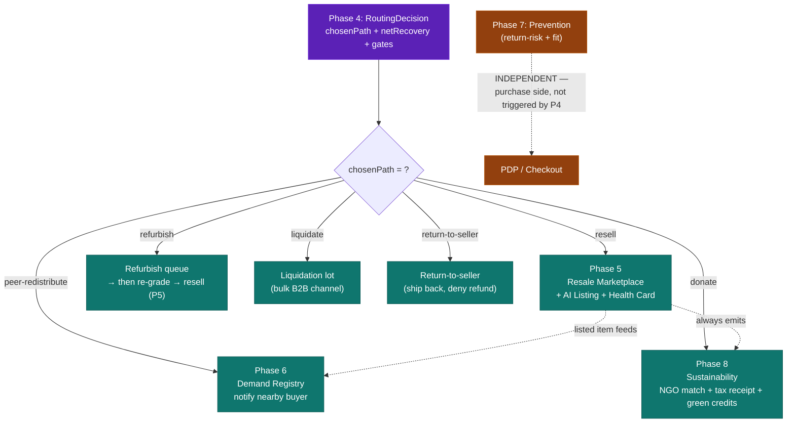
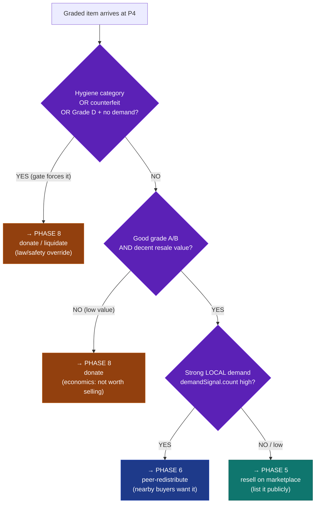
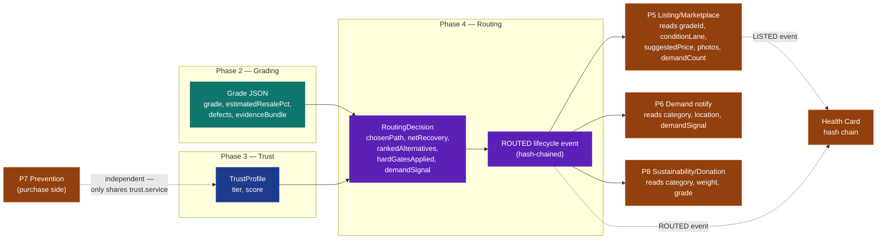

# Phase 4 — Smart Routing Engine, Explained Simply (+ Implementation Plan)

> A plain-language walkthrough of what Phase 4 does, how it plugs into the AI Grading
> System, and a concrete, repo-grounded plan to build it.
>
> Sources analysed:
> - `Phase4-SmartRouting-Implementation.md` (the detailed build spec)
> - `Phase4-Updates-Summary.md` (post-merge integration notes)
> - `v1.43 Grading System Overview DOC.md` (the grading pipeline that feeds Phase 4)
> - Actual repo state: `backend/src/modules/routing/**`, `contracts/routingDecision.contract.js`

---

## Part 1 — The One-Sentence Idea

When a product comes back (a return) or is sent in to be resold, **something has to decide
what to do with that physical item next.** Phase 4 is the "brain" that makes that decision
automatically: should we resell it, refurbish it, donate it, scrap it for cash, send it back
to the seller, or hand it to a nearby buyer?

That brain is the **Smart Routing Engine**.

---

## Part 2 — A Real-World Analogy

Imagine a sorting clerk standing at the end of a returns conveyor belt. For every item that
arrives, the clerk asks:

1. **What condition is it in?** (Is it like-new, scratched, or broken?)
2. **Can we trust the person who sent it?** (Honest seller or repeat scammer?)
3. **Does anyone nearby actually want it?**
4. **How much money would each option make or lose** after shipping costs?
5. **Are there any hard rules I must obey?** (e.g. you legally can't resell used innerwear.)

Then the clerk picks the single best destination and writes a short note explaining *why*.

Phase 4 **is that clerk, automated.** It never guesses — it follows fixed math and fixed
rules, so the same item always gets the same decision. That predictability is intentional
(great for demos, and easy to explain to a customer who disputes the outcome).

---

## Part 3 — How Grading Feeds Into Routing (the Key Link)

This is the heart of your question: **how does the grading system hand off to Phase 4?**

### Step A — Grading finishes its job (Phase 2)

From `v1.43 Grading System Overview DOC.md`, the grading pipeline ends at **Pass 2 — Grade
Synthesizer**, which produces a **Grade JSON** and stores it in MongoDB. The important fields
it produces are:

| Grade field | Example | What it means for routing |
|---|---|---|
| `grade` | `"B"` | Overall condition A/B/C/D — drives the "conditionFactor" multiplier |
| `quality_score` | `74` | Numeric quality (0–100) |
| `estimated_resale_pct` | `0.55` | "This item can sell for ~55% of original price" — the single most important number for the money math |
| `routing_hint` | `"p2p_or_local"` | A *suggestion* from grading, e.g. "good for peer-to-peer" |
| `defects[]` | `[{type:"scratch"...}]` | Used to detect counterfeit / damage gates |
| `confidence` | `"high"` | If `"low"`, routing must NOT run yet |
| `missing_evidence` | `[]` | If non-empty, routing must NOT run yet |

### Step B — The handoff gate (the critical rule)

The grading doc says clearly:

> [10] Grade stored in MongoDB → if confidence "low" OR missing_evidence non-empty →
> **flagged for human review** → else **Smart Routing engine triggered**

So routing only starts when grading is **confident and complete.** If grading is unsure, a
human looks at it first. Phase 4 enforces this: if `grade.flaggedForReview` is true, it
**refuses to auto-route** and returns a `409` error ("awaiting human review").

### Step C — Routing reads the grade (it never re-grades)

Phase 4 treats the `grades` collection as **READ-ONLY**. It calls
`grading.service.getGradeByItemId(itemId)` to fetch the grade, then uses those numbers as
*inputs* to its own money math. It does not change the grade, re-run any AI, or touch the
grading module's files.

**In short:** Grading answers *"what condition is it in and what's it worth?"*
Routing answers *"given that, where should it physically go to recover the most value?"*

```
GRADING (Phase 2)                         ROUTING (Phase 4)
─────────────────                         ─────────────────
Pass 2 → Grade JSON ──────────────────►  reads grade.estimatedResalePct
  grade: B                                reads grade.grade  (A/B/C/D)
  estimatedResalePct: 0.55                reads grade.defects (counterfeit?)
  confidence: high      ── gate check ──► reads grade.confidence/flagged
  routingHint: p2p_or_local               │
  defects: [scratch]                      ▼
                                          scores 6 paths → picks winner → ROUTED
```

---

## Part 4 — What Routing Actually Does, Step by Step

When `computeRoutingDecision(itemId)` runs, it goes through this sequence (simplified from
`Phase4-SmartRouting-Implementation.md §7`):

1. **Look up the item** (`item.service.getItemById`). Must exist and be in `GRADED` state.
   If it's already `ROUTED`, just return the existing decision (no double work).
2. **Fetch the grade** (`grading.service.getGradeByItemId`). If flagged for human review →
   stop with a `409`.
3. **Fetch the seller's trust profile** (`trust.service.getTrustProfile`). Could be `null`
   (handled safely). Tells us tier: normal vs `restricted` (repeat offender).
4. **Get the original price + category** from the linked product record.
5. **Ask about local demand** (`demand.service.matchDemandForItem`). Phase 6 isn't built yet,
   so this is wrapped defensively and defaults to `{ count: 0, radiusKm: 0 }`.
6. **Assemble all inputs** into one object.
7. **Score the 6 paths** using pure math (no database, no AI, no randomness).
8. **Apply hard gates** that can override the score.
9. **Save** the decision to the `routingDecisions` collection (one per item, upsert).
10. **Flip the item status** `GRADED → ROUTED` via `item.service.transitionStatus`, which
    also writes a lifecycle event.
11. **Return** the decision document.

---

## Part 4A — Complete Data Sources for Routing (What Goes Into Each Path)

The routing engine needs to gather data from 5 different sources. Here's exactly what data
is used and where it comes from:

### Data Source 1: Item Record (from `items` collection)

**What we read:**
```javascript
const item = await item.service.getItemById(itemId);
```

**Fields used:**
- `item._id` → the item being routed
- `item.status` → must be `GRADED` (gate check)
- `item.intakePath` → `'return'` or `'sell-used'` (affects which paths are candidates)
- `item.initiatorUserId` → used to fetch trust profile
- `item.originalProductId` → used to fetch price + category
- `item.location` *(future)* → used for distance calculation (currently uses `DEFAULT_DISTANCE_KM = 12`)

**Used by paths:** ALL (every path needs to know the item context)

---

### Data Source 2: Grade Record (from `grades` collection)

**What we read:**
```javascript
const grade = await grading.service.getGradeByItemId(itemId);
```

**Fields used:**
- `grade.grade` → `'A'` | `'B'` | `'C'` | `'D'` (drives `conditionFactor` multiplier)
- `grade.estimatedResalePct` → 0.0–1.0 (THE most important number — drives revenue for resell/refurbish/p2p)
- `grade.defects[]` → array of defects (checked for `type: 'counterfeit'` in Gate 2)
- `grade.status` → `'ok'` | `'fraud_rejected'` (if fraud, Gate 2 fires)
- `grade.flaggedForReview` → if `true`, routing STOPS (409 error)
- `grade.confidence` → `'high'` | `'medium'` | `'low'` (already checked before routing runs)
- `grade.missingEvidence[]` → if non-empty, item is flagged (already handled)

**Used by paths:**
- **`resell`**: `estimatedResalePct` (base revenue), `grade` (conditionFactor)
- **`refurbish`**: `estimatedResalePct` (base + uplift), `grade` (conditionFactor)
- **`peer-redistribute`**: `estimatedResalePct` (base × premium), `grade` (conditionFactor)
- **`donate`**: `grade` (conditionFactor only; revenue is fixed)
- **`liquidate`**: `grade` (conditionFactor only; revenue is fixed 8%)
- **`return-to-seller`**: `grade` (logged but doesn't affect score, always 0)

**Used by gates:**
- **Gate 2 (Counterfeit)**: checks `grade.status` and `grade.defects[]`
- **Gate 3 (Grade D + No Demand)**: checks `grade.grade === 'D'`

---

### Data Source 3: Trust Profile (from `trustProfiles` collection, via `trust.service`)

**What we read:**
```javascript
const trust = await trust.service.getTrustProfile(item.initiatorUserId);
// Could be null (new user, no history) → handled safely
```

**Fields used:**
- `trust.tier` → `'trusted'` | `'normal'` | `'restricted'` | `'banned'`
- `trust.score` → 0–100 (logged but not used in scoring currently)

**Used by paths:** NONE directly (trust doesn't affect revenue/cost math)

**Used by gates:**
- **Gate 4 (Restricted User)**: if `trust.tier === 'restricted'` AND `intakePath === 'return'` → force `return-to-seller`

---

### Data Source 4: Product Record (from `products` collection)

**What we read:**
```javascript
const product = await Product.findById(item.originalProductId).lean();
```

**Fields used:**
- `product.price` → original price in ₹ (THE denominator for all score calculations)
- `product.category` → `'clothing'` | `'electronics'` | `'innerwear'` | etc. (drives hygiene gate + weight lookup)

**Used by paths:** ALL (every path needs `price` to calculate netRecovery and normalize score)

**Used by gates:**
- **Gate 1 (Hygiene)**: if `product.category` in `HYGIENE_SENSITIVE_CATEGORIES` → force donate/liquidate

---

### Data Source 5: Demand Signal (from `demand.service.matchDemandForItem`, Phase 6)

**What we read:**
```javascript
const demand = await safeMatchDemand(product.category, item.location);
// Wrapped defensively: if Phase 6 not built or fails → { count: 0, radiusKm: 0 }
```

**Fields used:**
- `demand.count` → integer, number of nearby buyers who want this item
- `demand.radiusKm` → float, search radius in km

**Used by paths:**
- **`resell`**: demand boosts revenue via `demandMultiplier = 1 + min(count/10, 0.5)`
- **`peer-redistribute`**: demand boosts revenue + enables the path (requires `count > 0`)
- **Others**: NOT used (refurbish/donate/liquidate/return-to-seller don't care about demand)

**Used by gates:**
- **Gate 3 (Grade D + No Demand)**: if `grade === 'D'` AND `demand.count === 0` → force donate

---

### Data Source 6: Constants (from `routing.config.js`, NEW file)

These are **seeded constants** — no database reads, just a config file.

**What we read:**
```javascript
const {
  BASE_PICKUP_FEE,           // ₹40
  PER_KM_RATE,               // ₹1.5 per km
  weightBracketMultiplier,   // { <0.5kg: 1, <2kg: 1.5, <5kg: 2.2, else: 3.0 }
  REFURB_LIFT,               // 0.20 (20% resale uplift after repair)
  REFURB_COST,               // 0.15 (15% of price to repair)
  LIQUIDATION_RECOVERY,      // 0.08 (liquidators pay 8% of price)
  P2P_PREMIUM,               // 1.10 (p2p buyers pay 10% more)
  TAX_RECEIPT_VALUE,         // 0.30 (30% of price, notional tax deduction)
  GREEN_CREDIT_VALUE,        // ₹25 flat (sustainability credit)
  DEMAND_SATURATION,         // 10 (demand plateaus at 10 buyers)
  DEMAND_CAP,                // 0.5 (max 50% demand boost)
  conditionFactor,           // { A: 1.0, B: 0.85, C: 0.6, D: 0.3 }
  CATEGORY_WEIGHTS_KG,       // { clothing: 0.4, electronics: 1.5, ... }
  WAREHOUSES,                // [{ code, city, location:{lng,lat} }, ...]
  DEFAULT_DISTANCE_KM,       // 12 (fallback when no user location)
  HYGIENE_SENSITIVE_CATEGORIES, // ['innerwear', 'food', 'opened-cosmetics']
} = require('./routing.config');
```

**Why these are in a config file:** The repo has no warehouse, weight, or geo data today.
Phase 4 stays self-contained by seeding these constants so it doesn't depend on other modules.

**Used by paths:** ALL (every path needs logistics cost, grade factor, and revenue multipliers)

**Used by gates:**
- **Gate 1 (Hygiene)**: checks `HYGIENE_SENSITIVE_CATEGORIES`

---

### Summary: Data Dependency Table

| Data Source | Fields Used | Paths Using It | Gates Using It | Collection/Service |
|---|---|---|---|---|
| **Item** | status, intakePath, userId, productId, location | ALL | Gate 4 (intakePath), Gate 5 (intakePath) | `items` |
| **Grade** | grade, estimatedResalePct, defects, status, flagged | ALL | Gate 2 (defects, status), Gate 3 (grade) | `grades` |
| **Trust** | tier, score | NONE | Gate 4 (tier) | `trustProfiles` via `trust.service` |
| **Product** | price, category | ALL | Gate 1 (category) | `products` |
| **Demand** | count, radiusKm | resell, peer-redistribute | Gate 3 (count) | `demand.service` (Phase 6) |
| **Constants** | logistics rates, multipliers, factors | ALL | Gate 1 (hygiene list) | `routing.config.js` (NEW) |

**Key insight:** The engine reads from 4 existing collections (`items`, `grades`, `trustProfiles`,
`products`) + 1 future service (`demand`) + 1 new config file, but **writes to only 1 collection**
(`routingDecisions`). It never modifies the input data — pure read-only consumption.

---

## Part 4B — Complete Routing Workflow Diagram (Gate Checks + Scoring)

This diagram shows the FULL end-to-end flow from `computeRoutingDecision(itemId)` call to
final decision, including all data fetches, scoring, gate checks, and persistence.

```mermaid
flowchart TD
    START([computeRoutingDecision itemId]) --> FETCH_ITEM["1. Fetch Item<br/>item.service.getItemById(itemId)"]
    
    FETCH_ITEM --> CHECK_STATUS{Item exists?<br/>status === GRADED?}
    CHECK_STATUS -- "No / Wrong status" --> ERR_422["❌ 422 Unprocessable<br/>'Item not in GRADED state'"]
    CHECK_STATUS -- "Already ROUTED" --> RETURN_EXISTING["Return existing decision<br/>(idempotent)"]
    CHECK_STATUS -- "Yes, GRADED" --> FETCH_GRADE
    
    FETCH_GRADE["2. Fetch Grade<br/>grading.service.getGradeByItemId(itemId)"] --> CHECK_FLAGGED{Grade flagged<br/>for review?}
    CHECK_FLAGGED -- "Yes" --> ERR_409["❌ 409 Conflict<br/>'Awaiting human review'"]
    CHECK_FLAGGED -- "No" --> FETCH_TRUST
    
    FETCH_TRUST["3. Fetch Trust Profile<br/>trust.service.getTrustProfile(userId)"] --> FETCH_PRODUCT
    FETCH_PRODUCT["4. Fetch Product<br/>Product.findById(originalProductId)"] --> FETCH_DEMAND
    FETCH_DEMAND["5. Fetch Demand (defensive)<br/>safeMatchDemand(category, location)"] --> ASSEMBLE
    
    ASSEMBLE["6. Assemble Inputs Object<br/>{grade, trust, price, category,<br/>demand, distance, weight}"] --> LOG_START
    LOG_START["📊 ItemLogger.log<br/>'ROUTING_START'"] --> SCORE_PATHS
    
    %% SCORING PHASE
    subgraph SCORING["7. SCORING PHASE (routing.scoring.js)"]
        SCORE_PATHS["Score all 6 paths<br/>(or 5 if intakePath filters out return-to-seller)"]
        SCORE_PATHS --> CALC_RESELL["resell:<br/>revenue = price × resalePct × demandBoost<br/>cost = logistics + 8% fee<br/>score = normalize × conditionFactor × demandFactor"]
        SCORE_PATHS --> CALC_REFURB["refurbish:<br/>revenue = price × (resalePct + 0.20)<br/>cost = logistics + 15% repair + fee<br/>score = normalize × conditionFactor"]
        SCORE_PATHS --> CALC_P2P["peer-redistribute:<br/>revenue = price × resalePct × 1.10<br/>cost = short logistics + 5% fee<br/>score = normalize × conditionFactor × demandFactor"]
        SCORE_PATHS --> CALC_DONATE["donate:<br/>revenue = 0.30 × price + ₹25<br/>cost = short logistics<br/>score = normalize × conditionFactor"]
        SCORE_PATHS --> CALC_LIQ["liquidate:<br/>revenue = price × 0.08<br/>cost = bulk logistics<br/>score = normalize × conditionFactor"]
        SCORE_PATHS --> CALC_RTS["return-to-seller:<br/>revenue = 0<br/>cost = logistics<br/>score = 0 (always loses unless forced)"]
        
        CALC_RESELL --> RANKED
        CALC_REFURB --> RANKED
        CALC_P2P --> RANKED
        CALC_DONATE --> RANKED
        CALC_LIQ --> RANKED
        CALC_RTS --> RANKED
        
        RANKED["Rank by score (highest first)<br/>Preliminary winner = top scorer"]
    end
    
    RANKED --> GATE_CHECK
    
    %% GATE CHECKING PHASE
    subgraph GATES["8. HARD GATE CHECKING (checked in order)"]
        GATE_CHECK["Start gate checks"] --> GATE1
        
        GATE1{"Gate 1:<br/>Hygiene/Hazard<br/>Category?"}
        GATE1 -- "category in<br/>HYGIENE_SENSITIVE" --> GATE1_GRADE{Grade D?}
        GATE1_GRADE -- "Yes" --> FORCE_LIQ1["FORCE liquidate<br/>gate: HAZARDOUS_MATERIAL"]
        GATE1_GRADE -- "No (A/B/C)" --> FORCE_DONATE1["FORCE donate<br/>gate: HYGIENE_SENSITIVE"]
        GATE1 -- "No" --> GATE2
        
        GATE2{"Gate 2:<br/>Counterfeit/<br/>Fraud?"}
        GATE2 -- "status =<br/>fraud_rejected OR<br/>defect.type =<br/>counterfeit" --> FORCE_LIQ2["FORCE liquidate<br/>gate: COUNTERFEIT_DETECTED"]
        GATE2 -- "No" --> GATE3
        
        GATE3{"Gate 3:<br/>Grade D +<br/>No Demand?"}
        GATE3 -- "grade = D AND<br/>demandCount = 0" --> FORCE_DONATE3["FORCE donate<br/>gate: GRADE_D_NO_DEMAND"]
        GATE3 -- "No" --> GATE4
        
        GATE4{"Gate 4:<br/>Restricted User<br/>+ Returns?"}
        GATE4 -- "trustTier =<br/>restricted AND<br/>intakePath =<br/>return" --> FORCE_RTS["FORCE return-to-seller<br/>gate: RESTRICTED_USER_REPEAT_OFFENDER"]
        GATE4 -- "No" --> NO_GATE
        
        NO_GATE["No gate triggered<br/>Use scored winner"]
    end
    
    FORCE_LIQ1 --> FINAL_DECISION
    FORCE_DONATE1 --> FINAL_DECISION
    FORCE_LIQ2 --> FINAL_DECISION
    FORCE_DONATE3 --> FINAL_DECISION
    FORCE_RTS --> FINAL_DECISION
    NO_GATE --> FINAL_DECISION
    
    FINAL_DECISION["Final Decision:<br/>chosenPath + rankedAlternatives<br/>+ hardGatesApplied[] + netRecovery"] --> LOG_DEMAND
    LOG_DEMAND{"Demand count > 0?"}
    LOG_DEMAND -- "Yes" --> LOG_DEMAND_MSG["📊 ItemLogger.log<br/>'ROUTING_DEMAND'<br/>'N buyers within R km'"]
    LOG_DEMAND -- "No" --> LOG_GATE
    LOG_DEMAND_MSG --> LOG_GATE
    
    LOG_GATE{"Gate triggered?"}
    LOG_GATE -- "Yes" --> LOG_GATE_MSG["📊 ItemLogger.log<br/>'ROUTING_GATE'<br/>'Forced by: GATE_NAME'"]
    LOG_GATE -- "No" --> LOG_DECISION
    LOG_GATE_MSG --> LOG_DECISION
    
    LOG_DECISION["📊 ItemLogger.log<br/>'ROUTING_DECISION'<br/>'Chosen: path (₹X recovery)'"] --> PERSIST
    
    PERSIST["9. Persist to DB<br/>RoutingDecision.findOneAndUpdate<br/>{ itemId }, {...}, { upsert: true }"] --> TRANSITION
    
    TRANSITION["10. Transition Item Status<br/>item.service.transitionStatus<br/>(itemId, 'ROUTED', actor, data)"] --> LOG_STATUS
    LOG_STATUS["📊 ItemLogger.log<br/>'STATUS_UPDATE'<br/>'GRADED → ROUTED'"] --> LOG_COMPLETE
    LOG_COMPLETE["📊 ItemLogger.log<br/>'FLOW_COMPLETE'<br/>'Routing complete'"] --> RETURN
    
    RETURN([Return RoutingDecision document])
    
    %% STYLES
    classDef fetch fill:#3b82f6,stroke:#1e40af,color:#fff
    classDef check fill:#8b5cf6,stroke:#6d28d9,color:#fff
    classDef error fill:#ef4444,stroke:#b91c1c,color:#fff
    classDef score fill:#10b981,stroke:#047857,color:#fff
    classDef gate fill:#f59e0b,stroke:#d97706,color:#000
    classDef force fill:#ec4899,stroke:#be185d,color:#fff
    classDef log fill:#6366f1,stroke:#4338ca,color:#fff
    classDef persist fill:#14b8a6,stroke:#0d9488,color:#fff
    
    class FETCH_ITEM,FETCH_GRADE,FETCH_TRUST,FETCH_PRODUCT,FETCH_DEMAND fetch
    class CHECK_STATUS,CHECK_FLAGGED,LOG_DEMAND,LOG_GATE check
    class ERR_422,ERR_409 error
    class SCORE_PATHS,CALC_RESELL,CALC_REFURB,CALC_P2P,CALC_DONATE,CALC_LIQ,CALC_RTS,RANKED score
    class GATE1,GATE2,GATE3,GATE4,GATE1_GRADE gate
    class FORCE_LIQ1,FORCE_DONATE1,FORCE_LIQ2,FORCE_DONATE3,FORCE_RTS force
    class LOG_START,LOG_DEMAND_MSG,LOG_GATE_MSG,LOG_DECISION,LOG_STATUS,LOG_COMPLETE log
    class PERSIST,TRANSITION persist
```



---

## Part 4C — Gate Checking Logic (Detailed Flowchart)

This zoomed-in view shows ONLY the gate-checking phase in detail, with all conditions:



---

## Part 4D — Key Workflow Insights

### 1. Short-Circuit Behavior
**Gates are checked in order; first match wins and STOPS further checks.**

Example:
- Item: innerwear, Grade C, counterfeit detected
- Gate 1 (Hygiene) fires first → forces `donate`
- Gate 2 (Counterfeit) **never runs** (already overridden)
- Result: `chosenPath = 'donate'`, `hardGatesApplied = ['HYGIENE_SENSITIVE']`

### 2. Only ONE Gate Can Fire
`hardGatesApplied[]` will always be:
- `[]` (empty) — no gate triggered, use scored winner
- `['GATE_NAME']` (single element) — one gate triggered

Never multiple gates — the first match short-circuits.

### 3. Scoring Always Runs (Even If Overridden)
The engine ALWAYS scores all 6 paths first, then checks gates. This means:
- `rankedAlternatives` ALWAYS shows what the math said (transparent)
- The UI can display: *"Math said resell (₹700), but HYGIENE_SENSITIVE forced donate (₹93)"*
- User sees: "We wanted to resell, but law prohibits it"

### 4. Determinism Guaranteed
Same inputs → same decision, every time:
- Same item + grade + trust + demand + distance → same scores
- Same scores + same item data → same gate (or no gate)
- Same gate outcome → same `chosenPath`

No randomness, no network calls during scoring, no time-dependent logic.

### 5. Logging at Every Step
`ItemLogger.log()` is called 6 times (minimum):
1. `ROUTING_START` — when routing begins
2. `ROUTING_DEMAND` — if demand exists (optional)
3. `ROUTING_GATE` — if a gate fires (optional)
4. `ROUTING_DECISION` — final decision + ₹ recovery
5. `STATUS_UPDATE` — item status changed
6. `FLOW_COMPLETE` — routing done

All logs appear in the **Developer Logs Sidebar** (Phase 3.5) in real time.


From the frozen contract (`routingDecision.contract.js`), every item is scored against these
six options:

| Path | Plain meaning | When it tends to win |
|---|---|---|
| `resell` | Put it back on sale as-is | Good grade + decent resale % + demand |
| `refurbish` | Fix it up, then sell for more | Worth fixing — uplift beats the repair cost |
| `peer-redistribute` | Hand directly to a nearby buyer | Local demand exists, cheap short shipping |
| `donate` | Give to charity (tax + green credit value) | Low value, no demand, or hygiene rule |
| `liquidate` | Bulk-sell cheap for scrap value | Broken (Grade D) or counterfeit |
| `return-to-seller` | Send back to original seller | Only on the returns path |

---

## Part 6 — How the Money Math Works (Simply)

For each path, the engine calculates **netRecovery = money in − money out**, then converts it
to a normalized **score**. (Constants live in a new `routing.config.js`.)

```
netRecovery(path) = expectedRevenue(path) − expectedCost(path)

score(path) = clamp01(netRecovery / price)     ← 0 to 1, "how much value we recover"
              × conditionFactor[grade]          ← A=1.0, B=0.85, C=0.6, D=0.3
              × demandFactor(demandCount)        ← boosts resell & p2p only
```

- **Revenue** mostly comes from grading's `estimatedResalePct × price`, tweaked per path
  (refurbish adds a "lift", liquidate recovers only ~8%, donate earns tax + green credit value).
- **Cost** is mainly **reverse-logistics** (pickup + shipping), estimated from distance and a
  weight-bracket multiplier:

```
reverseLogisticsCost = BASE_PICKUP_FEE + distanceKm × PER_KM_RATE × weightBracketMultiplier
```

The path with the **highest score wins** — unless a hard gate overrides it.

---

## Part 6A — Detailed Scoring for Each of the Six Paths

Here's exactly how each path calculates revenue, cost, and final score:

### Path 1: `resell` (Put it back on sale as-is)

**Revenue:**
```javascript
revenue = price × estimatedResalePct × demandMultiplier
// where demandMultiplier = 1 + min(demandCount / DEMAND_SATURATION, DEMAND_CAP)
// Example: 10 local buyers → demandMultiplier = 1 + min(10/10, 0.5) = 1.5 (50% boost)
```

**Cost:**
```javascript
cost = reverseLogisticsCost + PLATFORM_FEE
// PLATFORM_FEE = 0.08 × revenue (8% commission)
```

**Score:**
```javascript
netRecovery = revenue - cost
score = clamp01(netRecovery / price) × conditionFactor[grade] × demandFactor
```

**When it wins:** Good grade (A/B), decent resale %, and local demand exists.

**Real example:**
- Item: ₹1,000 shoe, Grade B, estimatedResalePct = 0.60
- demandCount = 8 buyers nearby
- demandMultiplier = 1 + min(8/10, 0.5) = 1.4
- revenue = 1000 × 0.60 × 1.4 = ₹840
- cost = reverseLogistics(12km, 0.9kg) + (0.08 × 840) = ₹72 + ₹67 = ₹139
- netRecovery = 840 - 139 = ₹701
- score = (701/1000) × 0.85 × 1.4 = **0.83** ← HIGH, likely winner

---

### Path 2: `refurbish` (Fix it up, then sell)

**Revenue:**
```javascript
uplift = min(estimatedResalePct + REFURB_LIFT, 0.95)
// REFURB_LIFT = 0.20 (refurbishing adds 20% to resale value)
revenue = price × uplift
```

**Cost:**
```javascript
refurbCost = REFURB_COST × price  // REFURB_COST = 0.15 (15% of price to repair)
cost = reverseLogisticsCost + refurbCost + PLATFORM_FEE
```

**Score:**
```javascript
netRecovery = revenue - cost
score = clamp01(netRecovery / price) × conditionFactor[grade]
// No demand boost (refurb happens at warehouse, demand doesn't matter yet)
```

**When it wins:** Grade B/C items where the repair cost is small relative to the resale uplift.

**Real example:**
- Item: ₹2,000 camera, Grade C, estimatedResalePct = 0.45
- uplift = min(0.45 + 0.20, 0.95) = 0.65
- revenue = 2000 × 0.65 = ₹1,300
- refurbCost = 0.15 × 2000 = ₹300
- reverseLogistics = ₹85
- platformFee = 0.08 × 1300 = ₹104
- cost = 85 + 300 + 104 = ₹489
- netRecovery = 1300 - 489 = ₹811
- score = (811/2000) × 0.6 = **0.24**
- Compare to resell: revenue = 2000 × 0.45 = ₹900, cost = ₹157, net = ₹743, score = (743/2000) × 0.6 = **0.22**
- **Refurbish wins** (₹811 > ₹743)

---

### Path 3: `peer-redistribute` (Hand directly to nearby buyer)

**Revenue:**
```javascript
revenue = price × estimatedResalePct × P2P_PREMIUM
// P2P_PREMIUM = 1.10 (buyers pay 10% more for local, instant pickup)
```

**Cost:**
```javascript
shortHaulDistance = min(distanceKm, 5)  // p2p is always local (<5km)
cost = reverseLogisticsCost(shortHaulDistance, weightKg) + SMALL_PLATFORM_FEE
// SMALL_PLATFORM_FEE = 0.05 × revenue (lower than resell, no storage/listing cost)
```

**Score:**
```javascript
netRecovery = revenue - cost
score = clamp01(netRecovery / price) × conditionFactor[grade] × demandFactor
// Only enabled if demandCount > 0 (needs local buyers)
```

**When it wins:** Grade A/B, high local demand, low shipping distance.

**Real example:**
- Item: ₹800 book, Grade A, estimatedResalePct = 0.70
- demandCount = 12 buyers within 3km
- demandFactor = 1 + min(12/10, 0.5) = 1.5
- revenue = 800 × 0.70 × 1.10 = ₹616
- shortHaulCost = reverseLogistics(3km, 0.6kg) = ₹44
- platformFee = 0.05 × 616 = ₹31
- cost = 44 + 31 = ₹75
- netRecovery = 616 - 75 = ₹541
- score = (541/800) × 1.0 × 1.5 = **1.01** ← CAPPED at 1.0, **highest possible**
- Compare to resell: net = ₹450, score = 0.84
- **P2P wins** (local demand + lower logistics)

---

### Path 4: `donate` (Give to charity)

**Revenue:**
```javascript
revenue = TAX_RECEIPT_VALUE + GREEN_CREDIT_VALUE
// TAX_RECEIPT_VALUE = 0.30 × price (notional value for donor)
// GREEN_CREDIT_VALUE = ₹25 flat (Phase 8 sustainability credit)
```

**Cost:**
```javascript
shortHaulDistance = min(distanceKm, 8)  // donate to local charity
cost = reverseLogisticsCost(shortHaulDistance, weightKg)
```

**Score:**
```javascript
netRecovery = revenue - cost
score = clamp01(netRecovery / price) × conditionFactor[grade]
```

**When it wins:** Low-value items (Grade C/D, low resale %), or forced by hygiene gate.

**Real example:**
- Item: ₹400 worn t-shirt, Grade C, estimatedResalePct = 0.25
- revenue = (0.30 × 400) + 25 = ₹120 + ₹25 = ₹145
- cost = reverseLogistics(8km, 0.4kg) = ₹52
- netRecovery = 145 - 52 = ₹93
- score = (93/400) × 0.6 = **0.14**
- Compare to resell: revenue = 400 × 0.25 = ₹100, cost = ₹85, net = ₹15, score = 0.02
- **Donate wins** (₹93 > ₹15, and avoids the cost of listing/storing a low-value item)

---

### Path 5: `liquidate` (Bulk-sell cheap for scrap)

**Revenue:**
```javascript
revenue = price × LIQUIDATION_RECOVERY
// LIQUIDATION_RECOVERY = 0.08 (liquidators pay 8% of original price)
```

**Cost:**
```javascript
bulkLogisticsCost = reverseLogisticsCost × 0.6  // cheaper (bulk pickup)
cost = bulkLogisticsCost
```

**Score:**
```javascript
netRecovery = revenue - cost
score = clamp01(netRecovery / price) × conditionFactor[grade]
```

**When it wins:** Grade D items, or forced by counterfeit gate.

**Real example:**
- Item: ₹3,000 broken laptop, Grade D, estimatedResalePct = 0.10
- revenue = 3000 × 0.08 = ₹240
- cost = reverseLogistics(12km, 1.5kg) × 0.6 = ₹78 × 0.6 = ₹47
- netRecovery = 240 - 47 = ₹193
- score = (193/3000) × 0.3 = **0.02**
- Compare to donate: revenue = (0.30 × 3000) + 25 = ₹925, cost = ₹78, net = ₹847, score = 0.17
- **Donate wins** normally, BUT if Grade D + no demand gate fires → liquidate forced

---

### Path 6: `return-to-seller` (Send back to original seller)

**Revenue:**
```javascript
revenue = 0  // platform earns nothing (customer keeps item, no resale)
// BUT avoids refund cost: implicit savings = price × estimatedResalePct
```

**Cost:**
```javascript
cost = reverseLogisticsCost  // ship back to seller
```

**Score:**
```javascript
netRecovery = -cost  // negative (we pay to ship, earn nothing)
score = 0  // always lowest score unless forced by gate
```

**When it wins:** ONLY when forced by `RESTRICTED_USER_REPEAT_OFFENDER` gate.

**Real example:**
- Item: ₹1,500 shoe, Grade B, restricted user (trust tier: restricted)
- Math says: resell for ₹900 profit
- **Gate 4 fires** → forces `return-to-seller`
- netRecovery = -₹72 (we pay shipping)
- User outcome: "Return rejected. Item shipped back. No refund."
- Platform saves: ₹1,500 refund (would have paid if return accepted)

---

### Scoring Summary Table

| Path | Revenue formula | Cost formula | Typical winner scenario |
|---|---|---|---|
| `resell` | `price × resalePct × demandBoost` | logistics + 8% fee | Grade A/B, demand exists |
| `refurbish` | `price × (resalePct + 0.20)` | logistics + 15% repair + fee | Grade B/C, repair worth it |
| `peer-redistribute` | `price × resalePct × 1.10` | short logistics + 5% fee | Grade A/B, high local demand |
| `donate` | `0.30 × price + ₹25` | short logistics | Low value, or hygiene gate |
| `liquidate` | `price × 0.08` | bulk logistics (cheap) | Grade D, or counterfeit gate |
| `return-to-seller` | `0` (implicit savings) | logistics | Restricted user gate only |

**Key insight:** The score is **always normalized to 0–1** (net recovery ÷ original price),
so a ₹100 item and a ₹10,000 item are scored fairly — what matters is **% value recovered**,
not absolute ₹ amount.

> **Why no AI / no ML model here?** The spec deliberately chose deterministic rules because
> (a) explainability *is* the product — you show customers live bars with ₹ values and a
> reason; (b) there's no historical outcome data to train a model on; (c) same input → same
> output makes demos safe. (See `Phase4-SmartRouting-Implementation.md §10`.)

---

## Part 7 — Hard Gates (Rules That Beat the Math)

Some decisions are not about money — they're about law, safety, or trust. These **hard gates**
run *after* scoring and override the winner. The gates are checked **in order** — the first
match short-circuits and forces a specific path.

### How Gates Are Applied (Step by Step)

```javascript
// Pseudo-code from routing.scoring.js (to be implemented)

function applyHardGates(inputs, scoredPaths) {
  const hardGatesApplied = [];
  let forcedPath = null;

  // Gate 1: Hygiene/Hazard Category Check
  if (HYGIENE_SENSITIVE_CATEGORIES.includes(inputs.category)) {
    if (inputs.grade === 'D') {
      forcedPath = 'liquidate';
      hardGatesApplied.push('HAZARDOUS_MATERIAL');
    } else {
      forcedPath = 'donate';
      hardGatesApplied.push('HYGIENE_SENSITIVE');
    }
    return { forcedPath, hardGatesApplied };
  }

  // Gate 2: Counterfeit/Fraud Detection
  if (inputs.gradeStatus === 'fraud_rejected' || 
      inputs.defects.some(d => d.type === 'counterfeit')) {
    forcedPath = 'liquidate';
    hardGatesApplied.push('COUNTERFEIT_DETECTED');
    return { forcedPath, hardGatesApplied };
  }

  // Gate 3: Grade D + No Demand
  if (inputs.grade === 'D' && inputs.demandCount === 0) {
    forcedPath = 'donate';
    hardGatesApplied.push('GRADE_D_NO_DEMAND');
    return { forcedPath, hardGatesApplied };
  }

  // Gate 4: Restricted User (Repeat Offender)
  if (inputs.trustTier === 'restricted' && inputs.intakePath === 'return') {
    forcedPath = 'return-to-seller';
    hardGatesApplied.push('RESTRICTED_USER_REPEAT_OFFENDER');
    return { forcedPath, hardGatesApplied };
  }

  // Gate 5: Intake-Path Filtering
  // (Not a forcing gate, but removes invalid candidates)
  // Already handled in scorePaths() — return-to-seller only for returns path

  // No gate triggered → use the scored winner
  return { forcedPath: null, hardGatesApplied: [] };
}
```

### The Five Hard Gates (Detailed Logic)

#### Gate 1: Hygiene/Hazard Categories
**What triggers it:**
- Item category is in `HYGIENE_SENSITIVE_CATEGORIES` array
  - Examples: `'innerwear'`, `'food'`, `'opened-cosmetics'`, `'hazardous'`

**What it checks:**
```javascript
if (category === 'innerwear' || category === 'food' || ...) {
  // Cannot resell for hygiene/legal reasons
}
```

**What it forces:**
- If Grade D (broken/unsanitary) → **`liquidate`** (scrap it)
- Else (Grade A/B/C) → **`donate`** (charity can redistribute if suitable)

**Gate name recorded:** `HYGIENE_SENSITIVE` or `HAZARDOUS_MATERIAL`

**Real example:**
- User returns used innerwear (Grade B, looks good)
- Math says: resell for ₹200 profit
- **Gate blocks resale** (hygiene law) → forces `donate` instead

---

#### Gate 2: Counterfeit/Fraud Detection
**What triggers it:**
- `grade.status === 'fraud_rejected'` (hard fraud caught in grading Pass 1), OR
- `grade.defects[]` contains a defect with `type: 'counterfeit'`

**What it checks:**
```javascript
if (grade.status === 'fraud_rejected') {
  // Hard fraud signal (stock photo, EXIF missing, web match)
}
if (grade.defects.some(d => d.type === 'counterfeit')) {
  // Pass 2 AI detected fake branding/labels
}
```

**What it forces:** **`liquidate`** (scrap for parts, never resell a fake)

**Gate name recorded:** `COUNTERFEIT_DETECTED`

**Real example:**
- User submits "genuine" luxury handbag (Grade A, looks perfect)
- Grading detects: wrong font on logo, stitching pattern doesn't match brand
- AI writes `defects: [{type: 'counterfeit', severity: 'major'}]`
- Math says: resell for ₹8,000 profit
- **Gate blocks resale** (liability risk) → forces `liquidate` (₹500 scrap value)

---

#### Gate 3: Grade D + No Local Demand
**What triggers it:**
- `grade === 'D'` (broken/heavily damaged), AND
- `demandCount === 0` (nobody nearby wants this item)

**What it checks:**
```javascript
if (grade === 'D' && demandSignal.count === 0) {
  // Item is broken AND no buyer wants it
}
```

**What it forces:** **`donate`** (charity may find a use, or recycle responsibly)

**Gate name recorded:** `GRADE_D_NO_DEMAND`

**Real example:**
- User returns a broken toaster (Grade D, doesn't heat)
- Math says: refurbish for ₹150 profit (repair cost ₹200, sell refurbed for ₹350)
- But `demandCount = 0` (toasters have low demand in this area)
- **Gate blocks refurbish** (uneconomical + no buyer) → forces `donate`

**Note:** If `demandCount > 0` even for Grade D, the gate does NOT fire — someone might
want it for parts, so the math runs normally and refurbish/liquidate compete.

---

#### Gate 4: Restricted User (Repeat Offender)
**What triggers it:**
- `trustTier === 'restricted'` (Phase 3 Trust marked this user as high-risk), AND
- `intakePath === 'return'` (this is a return, not a sell-used submission)

**What it checks:**
```javascript
if (trust.tier === 'restricted' && item.intakePath === 'return') {
  // User has history of fraud/abuse on returns
}
```

**What it forces:** **`return-to-seller`** (send item back, deny refund/replacement)

**Gate name recorded:** `RESTRICTED_USER_REPEAT_OFFENDER`

**Real example:**
- User "brackets" (orders 5 sizes, returns 4) repeatedly (Trust score: 15/100, tier: restricted)
- Returns a shoe (Grade B, actually fine)
- Math says: resell for ₹1,200 profit
- **Gate blocks acceptance** (user abuses returns policy) → forces `return-to-seller`
- User receives: "Return rejected. Item shipped back to you. No refund issued."

**Important:** This gate ONLY applies to the `return` intake path. If a restricted user
tries to sell a used item (`intakePath === 'sell-used'`), they're allowed — the platform
just watches them closely (Phase 3 Trust logs their activity).

---

#### Gate 5: Intake-Path Candidate Filtering (Soft Gate)
**What it does:** This is NOT a forcing gate — it's a **candidate filtering rule** applied
during scoring, before the winner is chosen.

**Two rules:**

**Rule 5A: `return-to-seller` only for returns**
```javascript
if (intakePath !== 'return') {
  // Remove 'return-to-seller' from candidates
  // (You can't "return to seller" an item the user is selling to us)
}
```

**Rule 5B: `peer-redistribute` hold radius only for sell-used**
```javascript
if (intakePath === 'sell-used' && demandCount > 5) {
  // Boost p2p score (local buyers exist)
} else if (intakePath === 'return') {
  // Still allow p2p, but no special "hold for wider radius" option
}
```

**Why it's different:** These rules **don't override the winner** — they just change which
paths are in the race. If `intakePath === 'sell-used'`, the engine scores 5 paths (excludes
`return-to-seller`); if `intakePath === 'return'`, it scores all 6.

---

### Summary: How Gates Are Checked (Order Matters!)

```
START: All 6 paths scored, winner picked by highest score
         │
         ▼
    ┌─────────────────────────────────────┐
    │ Gate 1: Hygiene/Hazard Category?    │
    └─────────────────────────────────────┘
         │ YES → force donate/liquidate
         │ NO ↓
    ┌─────────────────────────────────────┐
    │ Gate 2: Counterfeit/Fraud?          │
    └─────────────────────────────────────┘
         │ YES → force liquidate
         │ NO ↓
    ┌─────────────────────────────────────┐
    │ Gate 3: Grade D + No Demand?        │
    └─────────────────────────────────────┘
         │ YES → force donate
         │ NO ↓
    ┌─────────────────────────────────────┐
    │ Gate 4: Restricted User + Returns?  │
    └─────────────────────────────────────┘
         │ YES → force return-to-seller
         │ NO ↓
         ▼
    Use the scored winner (no override)
```

**First match wins.** If Gate 1 fires, Gates 2–4 never run. This is efficient and
deterministic — same inputs always trigger the same gate (or none).

Whatever gate fires is recorded in `hardGatesApplied[]` so the UI can show:
> **"Forced by: HYGIENE_SENSITIVE"** (with a badge explaining why the math was overridden)

---

## Part 8 — What the User Sees (the "Wow" Moment)

The frontend component `RoutingRationale.jsx` renders **six horizontal bars**, one per path:
- Bar width = score, label = path name, plus the **₹ netRecovery**.
- The winning path is highlighted with a one-line plain-English rationale.
- If a gate forced the decision, a badge explains it.
- If local demand boosted resell, it shows *"📍 N buyers within R km."*

It mounts on `ItemStatusPage.jsx` once the item is `ROUTED`. Alongside it, the
**Developer Logs Sidebar** (added in Phase 3.5) shows the routing steps in real time, because
`routing.service` will emit `ItemLogger.log()` messages at each stage.

---

## Part 9 — Current State of the Code (verified in the repo)

| File | Status today | Needs |
|---|---|---|
| `routing.model.js` | ✅ Mostly complete (schema matches contract) | Minor: optional save-log hook |
| `routing.routes.js` | ✅ Wired (`/health`, `/compute`, `/:itemId`) | Health string `scaffolded` → `ok` |
| `routing.service.js` | 🔲 **Stub** (TODO only) | Full orchestration |
| `routing.controller.js` | 🔲 **Stub** (returns `501`) | Real handlers |
| `routing.validation.js` | 🔲 **Stub** (passthrough) | ObjectId validation |
| `routing.scoring.js` | ❌ Does not exist | **NEW** — pure math |
| `routing.config.js` | ❌ Does not exist | **NEW** — constants |
| `routingDecision.contract.js` | 🔒 **Frozen** — correct as-is | Do not edit |

So the skeleton is laid; the **engine and its math are not written yet.**

---

## Part 10 — Implementation Plan (Step by Step)

This follows the build order from the spec, adapted to the actual repo state and the Phase 3.5
logging integration. Estimated ~half a day solo.

### Step 1 — Constants: `routing.config.js` (NEW, no DB, no logic)
Create the self-contained data layer (the repo has no warehouse/weight/geo data):
- `BASE_PICKUP_FEE = 40`, `PER_KM_RATE = 1.5`, `weightBracketMultiplier` table.
- `REFURB_LIFT = 0.20`, `REFURB_COST = 0.15 × price`, `LIQUIDATION_RECOVERY = 0.08`,
  `P2P_PREMIUM = 1.10`, `TAX_RECEIPT_VALUE = 0.30 × price`, `GREEN_CREDIT_VALUE = 25`.
- `DEMAND_SATURATION = 10`, `DEMAND_CAP = 0.5`, `conditionFactor = {A:1, B:.85, C:.6, D:.3}`.
- `WAREHOUSES[]` (3–4 demo), `CATEGORY_WEIGHTS_KG`, `CATEGORY_DEPRECIATION`,
  `HYGIENE_SENSITIVE_CATEGORIES`, `DEFAULT_DISTANCE_KM = 12`.
- Add a local `HYGIENE_SENSITIVE` gate key and merge it with the frozen contract's `HARD_GATES`
  at runtime (do **not** edit the contract).

### Step 2 — Pure math: `routing.scoring.js` (NEW, no DB) + tests
Write pure, deterministic functions (easy to unit-test, no mocks needed):
- `haversine(a, b)` — distance between two coords (~10 lines).
- `reverseLogisticsCost(distanceKm, weightKg)`.
- `scorePaths(inputs)` — revenue/cost/score for all 6 paths.
- `applyHardGates(inputs, scored)` — override logic, returns `hardGatesApplied[]`.
- `rankAndChoose(scored, gates)` — sort, pick winner, build `rankedAlternatives`.
- Export a single `decide(inputs)` returning
  `{ chosenPath, rankedAlternatives, hardGatesApplied, reverseLogisticsCost }`.

Create `__tests__/routing.scoring.test.js` covering the 10 scenarios in spec §13
(Grade A high demand → resell; Grade D no demand → donate; hygiene → donate; counterfeit →
liquidate; restricted+returns → return-to-seller; determinism; cost monotonicity; etc.).
**Test-first: this needs no database.**

### Step 3 — Orchestration: `routing.service.js` (replace stub)
Implement `computeRoutingDecision(itemId)` per spec §7:
- Read item → grade → trust → product → demand (defensive `safeMatchDemand` wrapper).
- Guard: `grade.flaggedForReview` → throw `409`; item not `GRADED` → `422`.
- Call `routing.scoring.decide(inputs)`.
- `RoutingDecision.findOneAndUpdate({ itemId }, {...}, { upsert, new })` (idempotent).
- `item.service.transitionStatus(itemId, 'ROUTED', {role:'system'}, { routingDecisionId, chosenPath })`
  wrapped in try/catch.
- Implement `getDecisionByItemId(itemId)`.
- **Add the 6 `ItemLogger.log()` calls** from `Phase4-Updates-Summary.md §1`
  (`ROUTING_START`, `ROUTING_DEMAND`, `ROUTING_GATE`, `ROUTING_DECISION`, `STATUS_UPDATE`,
  `FLOW_COMPLETE`) so the Developer Logs Sidebar lights up.

### Step 4 — HTTP layer: `routing.validation.js` + `routing.controller.js`
- `validateComputeRouting`: require valid `itemId` ObjectId → else `400`.
- `getDecision` validator: validate `:itemId` ObjectId.
- Controller: real `computeRouting` (→ `201 { success, decision }`) and `getDecision`
  (→ `200` or `404`). Map service errors to `404/409/422`.
- Gate `POST /compute` behind `authMiddleware`; `GET /:itemId` for owner or admin.
- Change `/health` response from `scaffolded` to `ok`.

### Step 5 — Demo seed: `seed-routing.js` (NEW, additive, idempotent)
Mirror `seed-trust.js`. Create the personas from spec §12 (Priya→donate, Rahul→resell/p2p,
Anjali→resell, hygiene→donate gate, counterfeit→liquidate gate). Run
`computeRoutingDecision` for each and print a decision table (path + ₹ + gate). Never edit
`seed.js` or `seed-trust.js`.

### Step 6 — Frontend: `services/routing.js` + `RoutingRationale.jsx` (NEW)
- `routing.js`: `getDecision(itemId)` → `GET /api/routing/:itemId`;
  `computeRouting(itemId)` → `POST /api/routing/compute`.
- `RoutingRationale.jsx`: six horizontal bars, highlighted winner, gate badge, demand pin.
- Mount additively on `ItemStatusPage.jsx` (one import + one component) when
  `item.status === 'ROUTED'`. Optionally mount `DeveloperLogsSidebar` if not already there.

### Step 7 — Full pass + cleanup
Seed → `POST /compute` → `GET /:itemId` → render bars → confirm logs in the sidebar.
Run `npm test` (Jest already used in the repo). Remove any temp artefacts.

### Files you create / edit (and what you must NOT touch)

**Create:** `routing.config.js`, `routing.scoring.js`, `__tests__/routing.scoring.test.js`,
`seed-routing.js`, `frontend/src/components/routing/RoutingRationale.jsx`,
`frontend/src/services/routing.js`.

**Edit:** `routing.service.js`, `routing.controller.js`, `routing.validation.js`,
`routing.routes.js` (health string), and one additive mount in `ItemStatusPage.jsx`.

**Never touch (frozen / owned by others):** `routingDecision.contract.js`,
`modules/grading/**`, `modules/trust/**`, `modules/items/**` (call only),
`modules/demand/**` (call defensively), `ml-service/**`, `server.js`, `seed.js`,
`seed-trust.js`.

---

## Part 11 — Definition of Done (copy from spec §14)

- `POST /api/routing/compute { itemId }` returns a ranked 6-path decision with ₹ recovery, a
  clear winner, and any hard gates — for every seeded persona.
- `GET /api/routing/:itemId` returns the persisted decision.
- Item transitions `GRADED → ROUTED` and a `ROUTED` lifecycle event is written (via P1).
- `ItemStatusPage` renders the rationale bars; routing steps appear in the Developer Logs Sidebar.
- `routing.scoring.test.js` passes (all 10 cases).
- `seed-routing.js` prints the expected decision table on a fresh DB.
- Zero edits to grading/trust/items/demand/ml-service/contracts.

---

## Part 12 — How Phase 4 Outcomes Drive Phases 5, 6, 7 (Downstream Routing)

This is the question: **once Phase 4 picks a path, what happens next, and what data does it
forward?** Phase 4 is the "switchboard" — its `chosenPath` decides which downstream phase
gets triggered, and the `RoutingDecision` document (plus the linked Grade and Item) is the
data package handed forward.

> **Important honesty note (from `ParallelWorkplan.md`):** Phases **5, 6, and 8** sit
> *downstream* of P4 in Layer 3 — they consume routing outcomes. **Phase 7 (Prevention) is
> the exception: it is NOT triggered by P4.** P7 lives on the *purchase* side (PDP/checkout),
> not the *return/routing* side, and can start any time after P0. So when the question says
> "P5, P6, P7", the accurate mapping is: **P5 and P6 are driven by P4; P7 runs independently.**
> I cover all three below and flag P7's independence clearly.

### The Routing Decision as a "Switchboard"



---

### What Factors Decide Each Path (The Clear Picture)

The switchboard above shows *where* an item goes. This section explains *why* — the exact
factors that make the engine choose `resell` (→P5), `peer-redistribute` (→P6), or `donate`
(→P8). Remember the two-layer logic: **(1) scoring math picks a preliminary winner, then
(2) hard gates can override it.** A path is chosen either because it *won the math* or because
a *gate forced it*.

#### → PHASE 5 (Resale Marketplace): chosen when path = `resell` or `refurbish`

**The item goes to P5 when it is WORTH SELLING and ALLOWED to be sold.** The deciding factors:

| Factor | What pushes toward P5 (resell/refurbish) | Source |
|---|---|---|
| **Grade** | A or B (high `conditionFactor` 1.0 / 0.85) | `grade.grade` |
| **Resale value** | High `estimatedResalePct` (e.g. 0.5–0.8) → high revenue | `grade.estimatedResalePct` |
| **Net recovery** | `resell`/`refurbish` score beats all other paths | scoring math |
| **Repair economics** (refurbish) | Repair cost (15% of price) < resale uplift (20%) | `routing.config` |
| **No blocking gate** | Category not hygiene-sensitive, not counterfeit, not Grade D | gates pass |

**Plain rule:** *"Good condition + good resale value + no legal/fraud block → sell it."*
`refurbish` is the same idea but for borderline items (Grade B/C) where a cheap fix unlocks a
higher sale price — it goes to a repair queue, then re-grades, then becomes a P5 listing.

**Example:** ₹1,000 shoe, Grade B, resalePct 0.60, 8 nearby buyers → resell score 0.83 (winner),
no gate fires → **P5**. The buyer later sees "Condition: Good (Grade B)" — that text is the
grade carried through P4 into the listing.

---

#### → PHASE 6 (Demand Registry / Peer Redistribute): chosen when path = `peer-redistribute`

**The item goes to P6 when LOCAL BUYERS ALREADY WANT IT and shipping it short-distance is
cheap.** The deciding factors:

| Factor | What pushes toward P6 (peer-redistribute) | Source |
|---|---|---|
| **Local demand** | `demandSignal.count > 0` (real nearby "wants") — this is the #1 driver | `demand.service` |
| **Demand strength** | Higher count → bigger `demandFactor` boost (up to +50%) | scoring math |
| **P2P premium** | Local buyers pay 10% more (`P2P_PREMIUM = 1.10`) | `routing.config` |
| **Low logistics** | Short-haul distance (≤5km) makes cost tiny → high net recovery | scoring math |
| **Grade** | A/B (good enough that a peer wants it directly) | `grade.grade` |

**Plain rule:** *"Good item + someone nearby is already asking for it → hand it to them
directly instead of listing it on the open marketplace."* This wins over plain `resell`
**only when local demand is strong enough** that the demand boost + P2P premium + lower
shipping push its score above `resell`.

**Example:** ₹800 book, Grade A, **12 buyers within 3km** → demandFactor 1.5, p2p score ≈1.0
(maxed), beats resell (0.84) → **P6** notifies those 12 buyers.

> **Key distinction P5 vs P6:** Both need a good grade. The difference is **demand locality**.
> No/low local demand → list it publicly (P5 resell). Strong local demand → match it directly
> to nearby buyers (P6 peer-redistribute).

---

#### → PHASE 8 (Sustainability / Donation): chosen when path = `donate`

**The item goes to P8 when it is NOT WORTH SELLING, or when LAW/SAFETY forbids selling it.**
There are two completely different ways an item lands here:

**Way 1 — The math chose donate (economics):**

| Factor | What pushes toward P8 (donate) | Source |
|---|---|---|
| **Low resale value** | Low `estimatedResalePct` (e.g. 0.25) → resell revenue tiny | `grade.estimatedResalePct` |
| **Low/poor grade** | Grade C (conditionFactor 0.6) drags resell/refurbish scores down | `grade.grade` |
| **High relative logistics** | Shipping cost eats most of a cheap item's value | scoring math |
| **Donate value floor** | Donate earns tax receipt (30% of price) + ₹25 green credit, often beating a near-zero resell net | `routing.config` |

**Plain rule (economics):** *"Selling it would barely break even after shipping → donate it
instead and capture the tax + sustainability value."*

**Way 2 — A hard gate FORCED donate (law/safety), regardless of math:**

| Gate | Trigger | Why donate |
|---|---|---|
| `HYGIENE_SENSITIVE` | Category in `['innerwear','food','opened-cosmetics']`, Grade A/B/C | Legally can't resell, but still usable → charity |
| `GRADE_D_NO_DEMAND` | Grade D **and** `demandSignal.count === 0` | Broken and nobody wants it → donate/recycle |

**Plain rule (gate):** *"Even if the math wanted to sell it, hygiene law or a broken-with-no-
demand condition forces donation."*

**Example (economics):** ₹400 worn t-shirt, Grade C, resalePct 0.25 → donate net ₹93 beats
resell net ₹15 → **P8**.
**Example (gate):** Used innerwear, Grade B (math said resell ₹200) → `HYGIENE_SENSITIVE`
gate overrides → forced **P8**.

---

#### The Three-Way Decision at a Glance



**Read it top-to-bottom:**
1. **First ask: is there a law/safety/broken block?** → forces **P8** (donate/liquidate).
2. **If clear, ask: is it good + valuable enough to sell?** → if not, **P8** (donate, economics).
3. **If sellable, ask: do local buyers already want it?** → yes = **P6** (peer), no = **P5** (public resell).

**The three factors that matter most, in order:**
1. **Gates first** (category/fraud/broken) — these are non-negotiable.
2. **Value second** (grade + resalePct) — decides sellable vs. donate.
3. **Demand locality third** (demandSignal) — decides public resell (P5) vs. direct peer match (P6).

---

### Path → Phase Trigger Map (with the exact data forwarded)

| `chosenPath` | Triggers | What Phase 4 forwards | Source contract/field |
|---|---|---|---|
| `resell` | **P5** Listing Gen + Marketplace | item, grade, condition lane, suggested price base | `routingDecisions`, `grades` |
| `refurbish` | Refurbish queue → re-grade → **P5** | item, grade, refurb cost estimate | `routingDecisions.netRecovery` |
| `peer-redistribute` | **P6** Demand notify | item, category, location, `demandSignal` | `routingDecisions.demandSignal` |
| `donate` | **P8** Sustainability + Donation | item, grade, category, weight | `routingDecisions`, `grades` |
| `liquidate` | Liquidation lot (B2B) | item, grade, bulk recovery value | `routingDecisions.netRecovery` |
| `return-to-seller` | Return-to-seller flow | item, seller id, trust tier | `routingDecisions`, trust |

**The carrier of all this is the `ROUTED` lifecycle event.** Phase 4 calls
`item.service.transitionStatus(itemId, 'ROUTED', actor, { routingDecisionId, chosenPath })`.
That event (defined in `lifecycleEvent.contract.js → EVENT_TYPES`) is what downstream phases
listen for / read to know "this item is routed; here's where it goes."

---

### Phase 5 — Resale Marketplace + AI Listing + Health Card (triggered by `resell`)

**When:** `chosenPath === 'resell'` (or after a `refurbish` item is fixed and re-graded).

**What P4 forwards (the input dataset for P5):**

P5 doesn't get a brand-new payload — it reads the **already-stored records** that P4
finalized. The key fields it pulls (mapped to `listing.contract.js`):

| Listing field (P5 output) | Comes from | How |
|---|---|---|
| `gradeId` | `routingDecisions.gradeId` | direct link |
| `conditionLane` | `grade.grade` (A/B/C/D) | via `GRADE_TO_CONDITION_LANE` (A→like-new, B→good, C→fair, D→not listed) |
| `suggestedPrice` | `product.price × CONDITION_LANE_DISCOUNT[lane]` | like-new=25% off, good=45% off, fair=65% off |
| `intakePath` | `item.intakePath` | return | sell-used |
| `selectedPhotos` | grade evidence bundle (`evidenceBundle.imageUrls`) | the S3 photos already validated during grading |
| `demandCount` | `routingDecisions.demandSignal.count` | the geo demand P4 already measured |
| `aiGeneratedTitle/Description` | **new Bedrock call** in P5 | uses grade + product data as prompt input |
| `healthCardId` | P5 creates it | hash-chained lifecycle (see below) |

**Why the grade matters so much here:** The grade is what makes the listing *honest*. A buyer
sees "Condition: Good (Grade B), minor scratch on rear collar" — that text is literally the
`grade.defects[]` and `grade.rationale` surfaced from Phase 2, carried through P4, into the P5
listing. The `estimatedResalePct` that drove P4's resell decision also seeds the suggested price.

**Health Card connection:** P5 builds the **Product Health Card** (digital passport + QR) from
the **lifecycle event chain** — `INITIATED → EVIDENCE_SUBMITTED → GRADING → GRADED → ROUTED →
LISTED`. The `ROUTED` event Phase 4 emitted is one link in that SHA-256 hash chain
(`lifecycleEvent.contract.js`), so P4's decision is permanently recorded in the item's tamper-
evident history.

---

### Phase 6 — Demand Registry + Geo Matching (triggered by `peer-redistribute`, also feeds resell)

**When:** `chosenPath === 'peer-redistribute'` → P6 notifies nearby buyers who registered a "want".

**Two-way relationship with P4:**

1. **P4 → P6 (downstream):** When routing picks `peer-redistribute`, P6 takes the item +
   category + location and runs a `$geoNear` query against the `wants` collection to find and
   **notify the matching nearby buyers**.

2. **P6 → P4 (upstream input — this already happened):** During scoring, P4 *already called*
   `demand.service.matchDemandForItem(category, location)` to get `demandSignal = { count,
   radiusKm }`. That count is what boosted the resell/p2p score in the first place. So P6 is
   both an **input** to P4's decision and a **consumer** of it.

**What P4 forwards to P6:**

| Data | From | Used by P6 to |
|---|---|---|
| `item.category` | item record | match against `wants.category` |
| `item.location` (or warehouse) | item / `routing.config` | `$geoNear` center point |
| `routingDecisions.demandSignal` | P4 output | knows how many buyers already matched |
| `routingDecisions.chosenPath` | P4 output | only acts when path = peer-redistribute |

**Note (repo reality):** `demand.service.matchDemandForItem()` is currently a **stub** (Phase 6
not built). That's why P4 wraps it in `safeMatchDemand` and defaults to `{ count: 0 }`. Once P6
is real, the same interface lights up with no change to P4.

---

### Phase 7 — Prevention (Return-Risk + Fit) — INDEPENDENT of Phase 4

**This is the key clarification.** Per `ParallelWorkplan.md` Layer 3:

> "P7 (Prevention) has NO dependency on P1–P4. It lives on the *purchase* side, not the
> *return* side. You can start it any time after P0."

**What P7 actually does:** Before a customer buys (on the Product Detail Page / checkout), P7:
- Predicts **return probability** (XGBoost model on `ml-service`) and nudges the buyer.
- Recommends **size/fit** (KNN) to prevent wrong-size returns.

**How it relates to P4 (indirectly, not a trigger):**
- P7 tries to **stop returns from happening**; P4 **handles returns that do happen**. They're
  two ends of the same problem (return reduction vs. return disposition).
- The only **shared dependency** is `trust.service.getTrustProfile()` — both P4 and P7 read it
  (read-only), but neither triggers the other. No data flows P4 → P7.

**So the accurate statement:** Phase 4 does **not** forward any dataset to Phase 7. If the
question means "the three Layer-3 phases after P4," the real downstream trio driven by P4 is
**P5, P6, and P8** — and P7 runs in parallel on the purchase side.

---

### Phase 8 — Sustainability + Green Credits + Donation (triggered by `donate`)

**When:** `chosenPath === 'donate'` (often forced by the `HYGIENE_SENSITIVE` or
`GRADE_D_NO_DEMAND` gate).

**What P4 forwards to P8:**

| Data | From | Used by P8 to |
|---|---|---|
| `item` + `category` + weight | item / `routing.config.CATEGORY_WEIGHTS_KG` | compute CO₂ + water saved |
| `grade.grade` | grade record | decide donate vs. recycle suitability |
| `routingDecisions.chosenPath = donate` | P4 output | trigger NGO match + tax receipt |

P8 then computes `sustainabilityImpact = { co2SavedKg, waterSavedLiters }` (the same shape that
later appears on the P5 listing contract), matches an NGO, and issues green credits + a tax
receipt. The `DONATED` lifecycle event closes that branch of the item's hash chain.

---

### One Picture — The Full Data Handoff



---

### Summary: What Travels Downstream

1. **The `RoutingDecision` document** (`chosenPath`, `netRecovery`, `rankedAlternatives`,
   `hardGatesApplied`, `demandSignal`, `gradeId`, `trustProfileId`) — the decision itself.
2. **The `ROUTED` lifecycle event** — the trigger + permanent hash-chain record that tells
   downstream phases "act now."
3. **Read-through links** — downstream phases follow `gradeId` and `itemId` to read the full
   Grade JSON and Item record (P4 doesn't copy data; it links to it).

**Routing map:** `resell → P5` · `peer-redistribute → P6` · `donate → P8` ·
`refurbish → refurbish queue → P5` · `liquidate → B2B lot` · `return-to-seller → return flow`.
**P7 is not in this chain** — it's purchase-side prevention, sharing only the trust service.

---

## TL;DR

Grading decides **what condition an item is in and what it's worth** and stores a Grade JSON.
Phase 4's Smart Routing Engine reads that grade (only if grading was confident), combines it
with seller trust, local demand, and shipping cost, then runs **deterministic money math** to
score six destinations. Hard rules (hygiene, counterfeit, broken, repeat offenders) can
override the math. It saves one decision per item, flips the item to `ROUTED`, and shows the
user a transparent bar chart explaining exactly why that path won. The code skeleton exists;
the engine, its math, the config, the seed, and the UI still need to be built.
