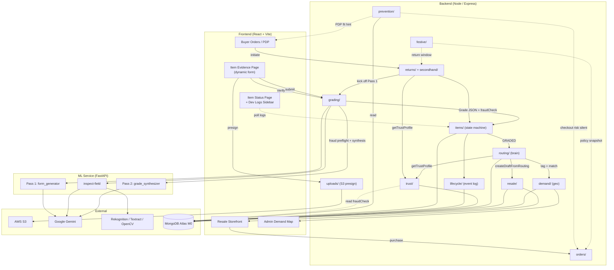
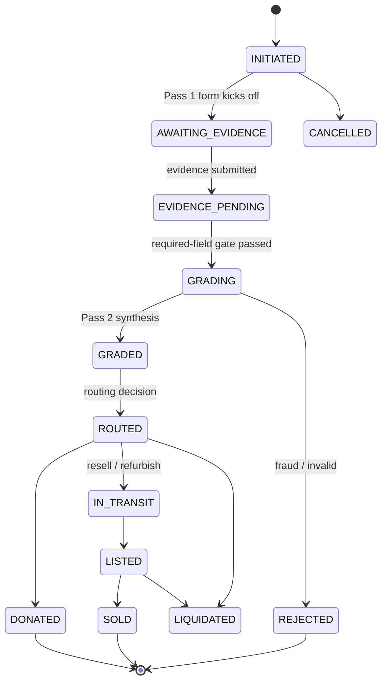
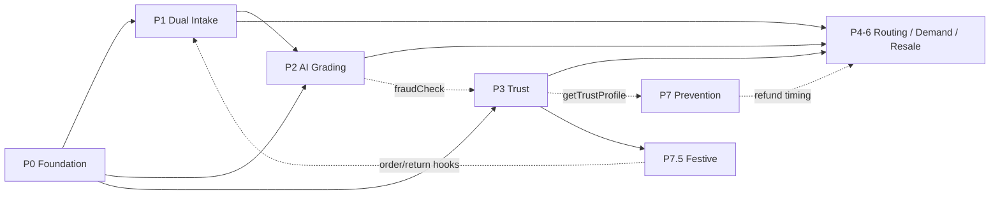

# Second-Life Marketplace — Unified Technical Documentation

> **Status:** Living document — consolidates Phase 0 through Phase 7.5 plus the
> Developer Logs cross-cutting feature.
> **Audience:** Engineers, solutions architects, and technical reviewers.
> **Purpose:** Single source of truth for the end-to-end system: what each subsystem
> does, how data flows, how the phases interact, and the overall architecture.

This document supersedes nothing — it *indexes and unifies* the per-phase planning
documents under `Meta/Solutions/Phases/`. Where a phase doc and the live code diverge,
this document follows the code (verified against `backend/server.js` and
`backend/src/modules/`).

---

## 1. Executive Summary

The platform extends an existing e-commerce marketplace with an **AI-powered reverse-commerce
and fraud-defence layer**. It does three things the base marketplace cannot:

1. **Intake** returns and used-item listings through one converged pipeline.
2. **Grade, route, and resell** those items using AI vision, a trust model, geo-demand
   matching, and a deterministic disposition engine — recovering value instead of writing it off.
3. **Prevent** bad returns before they happen using a closed-loop prevention intelligence
   layer and a calendar-aware festive-defence layer.

The whole system is built to run on modest infrastructure: **MongoDB Atlas M0 + Node/Express +
a Python FastAPI ML service**, with **Google Gemini** for multimodal reasoning and **AWS**
(S3, Rekognition, Textract, optionally Bedrock/KMS) for supporting services.

### 1.1 Subsystem Map

| Phase | Subsystem | Backend module(s) | Core responsibility |
|---|---|---|---|
| P0 | Foundation | `config/`, `contracts/`, `uploads/` | AWS, env, indexes, scaffolding, data contracts, S3 presign |
| P1 | Dual Intake | `returns/`, `secondhand/`, `items/`, `lifecycle/` | Two front doors → one `Item` + append-only event log |
| P2 | AI Grading | `grading/`, `prompts/`, ml-service | Dynamic claim-specific form → per-field inspection → grade |
| P3 | Trust & Fraud | `trust/` | Per-user trust profile, fraud clamps, P1/P4 seam |
| P4–P6 | Routing / Demand / Resale | `routing/`, `demand/`, `resale/`, `healthCard/`, `sustainability/` | Disposition brain, geo-demand, storefront |
| P7 | Prevention Intelligence | `prevention/`, `reviews/` | Pre-purchase return prevention (closed loop) |
| P7.5 | Festive Defense | `festive/`, hooks into `orders/`, `returns/` | Calendar-aware policy levers |
| X | Developer Logs | `items/` logs endpoint, `utils/itemLogger` | Real-time pipeline observability |

---

## 2. Technology Stack

| Layer | Technology | Notes |
|---|---|---|
| Backend | Node.js + Express | Module-per-domain (`controller`/`service`/`routes`/`validation`/`model`) |
| Datastore | MongoDB Atlas M0 (Mongoose) | `2dsphere` geo indexes for demand/warehouses |
| ML service | Python FastAPI + Uvicorn | Vision, form generation, grading synthesis |
| LLM | Google Gemini (`gemini-2.5-flash` primary, `-flash-lite` fallback) | via `google-genai` SDK; JSON mode |
| Vision | AWS Rekognition, Textract, OpenCV, perceptual hashing | Defect/label/OCR + fraud preflight |
| Object storage | AWS S3 (`ap-south-1`) | Browser direct upload via presigned URLs |
| Auth | Clerk | Middleware-based; `req.user` with role |
| Signing (optional) | AWS KMS / Ed25519 + `qrcode` | Health Card hash chain (stretch) |
| Frontend | React (Vite) + Tailwind/shadcn + framer-motion + axios | |
| Map UI | react-leaflet + OpenStreetMap | Admin Demand Map (Chhattisgarh) |
| Tests | Jest (backend), Pytest (ml-service) | |

---

## 3. Canonical Data Contracts

The contracts in `backend/src/contracts/` are the frozen shapes every phase depends on.
They decouple parallel teams: a downstream phase populates a forward-reference field on a
shared document without renaming or removing anything upstream.

| Contract file | Defines | Primary consumer |
|---|---|---|
| `lifecycleEvent.contract.js` | Event types, hash-chain shape | P1, P5 |
| `grade.contract.js` | Grade JSON (grade, qualityScore, defects, estimatedResalePct, routingHint) | P2 → P4 |
| `trustProfile.contract.js` | `TRUST_TIERS`, `TIER_THRESHOLDS`, `TRUST_SIGNALS`, `RETURN_RATE_THRESHOLDS` | P3 (frozen) |
| `routingDecision.contract.js` | chosenPath, rankedAlternatives, hard gates | P4 |
| `listing.contract.js` / `resaleListing.contract.js` | Resale listing shape, trigger paths | P5 |
| `demand.contract.js` | Buyer-post + warehouse shape | P6 |
| `festive.contract.js` | Event codes, multipliers, COD caps, policies | P7.5 |
| `prevention.contract.js` (in module) | Scorecard weights, bands | P7 |

### 3.1 The Convergence Model (`Item`)

`Item` is the architectural pivot. Both intake paths (`Return`, `SecondhandItem`) keep their
intake-specific fields, but both produce a single `Item` carrying the universal state machine
and the forward-reference IDs that later phases populate.

```
Item {
  intakePath: 'return' | 'sell-used'
  returnId | secondhandId            // back-ref to intake record
  originalOrderId, originalProductId, category, reasonCode, reasonText
  evidencePhotos[], clarifyingPhotos[]
  evidenceForm { status, schema, schemaVersion, provider }   // P2
  evidenceFieldImages { fieldId: [urls] }                    // P2
  status: <state machine>
  gradeId | routingDecisionId | healthCardId | listingId     // forward refs
  trustTierAtSubmission                                       // P3 snapshot
  ownerNotes                                                  // P5
}
```

### 3.2 The State Machine

```
INITIATED → AWAITING_EVIDENCE → EVIDENCE_PENDING → GRADING → GRADED
          → ROUTED → IN_TRANSIT → LISTED → SOLD
          → DONATED | LIQUIDATED | REJECTED | CANCELLED
```

| Transition | Owner phase |
|---|---|
| `INITIATED → AWAITING_EVIDENCE` | P2 (form generation kicks off at claim) |
| `AWAITING_EVIDENCE → EVIDENCE_PENDING → GRADING` | P1/P2 (evidence submit) |
| `GRADING → GRADED \| REJECTED` | P2 |
| `GRADED → ROUTED` | P4 |
| `ROUTED → IN_TRANSIT → LISTED → SOLD` | P4/P5 |
| `→ DONATED \| LIQUIDATED` | P4/P8 |

Every transition appends a `LifecycleEvent` (append-only, monotonically increasing `sequence`
per item; `previousHash`/`hash` reserved for the Health Card chain in P5).

---

## 4. Phase 0 — Foundation & Infrastructure

**Goal:** remove every "can't start" blocker. Provision cloud resources, scaffold modules,
lock data contracts.

### 4.1 What it delivers
- **AWS:** IAM user, S3 bucket (`ap-south-1`) with CORS for browser uploads, Bedrock model
  access (later superseded by Gemini for Pass 1), optional KMS signing key.
- **Env config:** unified `.env` covering Mongo, Clerk, AWS, S3, Bedrock, KMS, `ML_SERVICE_URL`.
- **Atlas indexes** (created by `backend/src/config/createIndexes.js`):

| Collection | Index | Purpose |
|---|---|---|
| `wants`/`demand` | `{ location: "2dsphere" }` | Geo demand matching (P6) |
| `items` | `{ status: 1, createdAt: -1 }`, `{ userId: 1, status: 1 }` | State queries, trust lookups |
| `lifecycleEvents` | `{ itemId: 1, sequence: 1 }` unique | Hash-chain ordering |
| `trustProfiles` | `{ userId: 1 }` unique | Trust score |
| `listings` | `{ conditionLane: 1, category: 1 }` | Marketplace browse |

- **Module scaffolding:** all domain modules created as `controller + model + routes + service + validation`.
- **FastAPI ML service skeleton:** routers (`grading`, `vision`, `prediction`, `health`),
  service wrappers (`bedrock`, `rekognition`, `textract`, `opencv_utils`, `clip_service`).
- **S3 presign utility:** `POST /api/uploads/presign` → `{ uploadUrl, key, publicUrl }`.
  Frontend `PUT`s bytes directly to S3 (Express never proxies the file).

### 4.2 Data flow
```
Browser → POST /api/uploads/presign → { uploadUrl } → Browser PUT bytes → S3
                                                          ↓
                              returned publicUrl stored on Item.evidencePhotos
```

---

## 5. Phase 1 — Dual-Intake Entry Points

**Goal:** two front doors, one downstream pipeline. No AI yet — screens, convergence model,
state machine, lifecycle log.

### 5.1 The two doors
| Intake | Endpoint | Record created |
|---|---|---|
| Return | `POST /api/returns` | `Return` + `Item(intakePath='return')` |
| Sell-used | `POST /api/secondhand/from-order` | `SecondhandItem` + `Item(intakePath='sell-used')` |

Both require a **verified order on this platform** (the "from-elsewhere" path was removed —
enforced at the service layer: `orderId` must belong to the requesting user).

### 5.2 Service responsibilities (`item.service.js`)
- `createItem(data)` — new `Item`, status `INITIATED`, first lifecycle event.
- `transitionStatus(itemId, next, actor, data)` — validates the transition against the
  allowed-transitions table, updates status, appends `LifecycleEvent`.
- `attachEvidence(itemId, photos, actor, { fieldImages })` — stores evidence + field→image
  map, gates required fields, transitions toward `GRADING`.
- `submitForGrading` — fire-and-forget `gradingService.triggerGrading(itemId, ctx)`.

### 5.3 Forward-reference contract (zero coupling)
P1 calls two interfaces it does not own, treating them as fire-and-forget stubs:
```
gradingService.triggerGrading(itemId, { evidencePhotos, category, originalProductId })
trustService.getTrustProfile(userId) → { tier, score } | null
```
If either throws or returns a stub, the item still progresses and the lifecycle event is
still recorded. This is what lets P1, P2, and P3 be built in parallel.

### 5.4 Frontend surface
`BuyerOrdersPage` (return button) → `ReturnInitiatePage` / `SellSecondhandPage` →
`ItemEvidencePage` (shared evidence shell) → `ItemStatusPage` (polling stepper).

---

## 6. Phase 2 — AI Grading Pipeline

Phase 2 evolved across two re-editions. The **current truth** is the union of:
- **v3.44** — the dynamic, claim-specific form became the spine of intake.
- **ReEdition 3 v2.35** — per-field *batched* inspection ("verify the field, not the photo").

### 6.1 The target flow (v2.35, current)
```
STEP A  Claim: reason + optional 1–2 clarifying photos → Item INITIATED
STEP B  Pass 1 (Gemini): generate a product- & claim-specific Form_Schema
        → Item AWAITING_EVIDENCE (generic fields instant → AI fields swap in)
STEP C  Per-field capture: user uploads N photos per field (S3 + phash/EXIF preflight only)
        → clicks "Verify Field" → ONE multimodal Gemini call judges the whole photo set
        → writes ONE field-level Evidence_Fragment
STEP D  Submit: required-field gate → Pass 2 text-only synthesis over fragments → Grade JSON
        → Item GRADED, GRADED lifecycle event emitted
```

### 6.2 The two passes

| Pass | Where | Input | Output |
|---|---|---|---|
| **Pass 1 — Form generation** | `form_generator.py`, `POST /grade/form` | productId + reason + category + clarifying photos | `Form_Schema { title, fields[], photo_guidance }` with per-field `expected_subject`, `validation_criteria`, `required` |
| **Field inspection** | `evidence_inspector.py`, `POST /vision/inspect-field` | one field's photo set + field meta + catalog ref | `{ accepted, reupload_reason, per_photo[], observations, missing_views[] }` |
| **Pass 2 — Synthesis** | `grade_synthesizer.py`, `POST /grade/` | all field-level fragments (text-only) | canonical Grade JSON |

### 6.3 Key design decisions
- **Gemini, not Bedrock**, for Pass 1/inspection: multimodal, native JSON mode, already traced.
  A `llm_provider` seam keeps model choice in config so a swap is a one-file change.
- **Per-field batched inspection** beats per-photo: a "both side views" field is judged once
  *as a set*, so the first-of-two photo is no longer wrongly rejected. Cost ≈ 1 call/field + 1
  synthesis, vs the old 1 call/photo.
- **Form persisted on the `Item`** (`evidenceForm` sub-doc) — survives restart; the in-memory
  `_formState` map is only a cache.
- **Fraud preflight** runs per photo at upload (perceptual-hash match vs catalog + EXIF
  camera-data check). A phash match HARD-rejects with a stock-photo-theft message — no LLM call.
- **Field→image mapping** is carried into the `Analysis_Summary` so Pass 2 can say
  "sole_photo shows heavy wear," and defect `location` carries the field name.
- **Cache key** = `hash(productId + normalized_reason)`, falling back to `category` when there
  is no catalog product; reason is normalized (lowercase/trim/strip punctuation).

### 6.4 Outputs consumed downstream
The persisted grade carries `grade (A–D)`, `qualityScore`, `confidence`, `defects[]`,
`estimatedResalePct`, `routingHint`, `rationale`, and a **`fraudCheck` block**
(`phash_match`, `exif_has_camera_data`, `rekognition_web_match`, `classification`) that **P3
reads** for fraud signals.

---

## 7. Phase 3 — Trust Score & Fraud Defence

**Goal:** attach a `TrustProfile` (tier + score + explainable signals) to every user so the
pipeline grades items *in the context of who submitted them*.

### 7.1 Architecture
A pure scoring core (`trust.scoring.js`, no DB) is wrapped by a service that does I/O
(`trust.service.js`): gather facts → score → persist to `trustProfiles`.

### 7.2 The two-layer model

**Layer 1 — weighted score (0–100, 100 = good).** All signals start at 100; bad behaviour
pulls down.

| Signal | Weight | Direction |
|---|---|---|
| Account age (saturates 365d) | 0.10 | + |
| Lifetime purchases (saturates 25) | 0.15 | + |
| Verified purchase (≥1 order) | 0.05 | + |
| Return rate (inverse, 0 at 40%) | 0.25 | − |
| Recent 90d rate (inverse, 0 at 50%) | 0.20 | − |
| No bracketing | 0.15 | − |
| No wardrobing | 0.10 | − |

`score → tier`: verified ≥90, trusted ≥75, standard ≥50, watch ≥30, restricted <30.

**Layer 2 — hard tripwires (clamp tier down regardless of score):**

| Tripwire | Verdict |
|---|---|
| `banned` | restricted |
| return rate ≥ 0.65 | restricted |
| ≥2 hard fraud hits | restricted |
| return rate ≥ 0.40 | cap at watch |
| **sudden shift** (90d rate ≥ 2× lifetime AND ≥ 0.30) | cap at watch |
| ≥1 hard fraud hit | cap at watch |
| bracketing AND wardrobing | cap at watch |
| soft fraud + any pattern flag | escalate one tier down |

### 7.3 Pattern detectors
- **Bracketing:** repeated same-`productId` purchases (proxy for size/colour variants) with
  all-but-one returned (guarded by min-orders).
- **Wardrobing:** returns clustering near the end of the return window (median daysHeld ≥ ~25).
- **Sudden shift:** the case a flat threshold misses — an account that *was* good and turned bad.

### 7.4 Fraud signal sources
1. **Pull (primary):** read each grade's `fraudCheck` block from the `grades` collection (read-only).
2. **Push (secondary):** `POST /api/trust/:userId/signals` for mocked signals
   (`LOCKER_WEIGHT_MISMATCH`, `PHOTO_OF_SCREEN`, etc.), stored append-only on the profile.

### 7.5 Integration seams (frozen)
- **P1:** `getTrustProfile(userId) → { tier, score } | null` — name + shape are the contract.
  An `attachTrustProfile` middleware lets P1/P4 mount it with one line (`req.trustProfile`).
- **Boundary:** P3 writes only to `trustProfiles`; never touches `returns/`, `secondhand/`,
  `items/`, `grading/`, `server.js`, base `seed.js`, or `auth.middleware`.

---

## 8. Phases 4–6 — Disposition, Demand & Resale (Consolidated)

These three former phases are one problem: **once an item is graded, where does it go, who
nearby wants it, and how does it become a trustworthy listing?** Built as two parallel
sub-phases (A = brain + geo, B = storefront) meeting only at a frozen `ResaleListing` contract.

### 8.1 The unified pipeline
```
GRADED → tag (LLM) → match nearby buyer posts (geo) → ROUTING DECISION → chosenPath
  ├─ peer-redistribute → customer → nearby buyer (one hop)
  ├─ resell / refurbish → BEST WAREHOUSE → ResaleListing → storefront
  ├─ donate → nearby NGO        ├─ liquidate → B2B lot
  └─ return-to-seller → refund flow (+ trust refund-hold)
```

### 8.2 Routing brain (`routing/`) — deterministic, explainable
- **6-path weighted scorecard:** resell, refurbish, donate, liquidate, return-to-seller,
  peer-redistribute. Grade-driven economics + reverse-logistics cost (Haversine + weight bracket).
- **Hard gates override the math:** counterfeit → liquidate, Grade-D + no demand → donate,
  hygiene/safety → donate/liquidate, restricted-user return → return-to-seller.
- **Refund timing (trust-driven):** trusted + cheap → refund immediately; standard → on
  resolution; low-trust → **refund held** until warehouse physical re-grade (anti-"shipped a brick").
- **Hold-at-home window** (default 48h): try a peer match before shipping; enables pickup batching.
- **Best-warehouse selection** (not nearest): `resaleValue × (1 + w·demand) − inbound −
  expectedOutbound − holdingCost`. A farther, high-demand warehouse can beat a nearer one.

### 8.3 Demand layer (`demand/`) — the geo signal
- **Buyer "Looking for…" posts:** free-text want + location + LLM-extracted tags + `2dsphere`.
- **LLM item tagging** (Gemini, keyword fallback) on graded items.
- **Tag + geo matching** (`$geoNear` + tag overlap) feeds the routing demand factor and the
  peer-handoff trigger.
- **Admin Demand Map** (`DemandMapPage`): Chhattisgarh map with ~6–8 seeded warehouses; a
  hardcoded search term overlays a normalized demand number per warehouse — visualizing the
  warehouse-vs-demand algorithm on small seeded data.

### 8.4 Three frozen seams
| Seam | Owner | Caller |
|---|---|---|
| `demand.service.matchDemandForItem(category, tags, location, radiusKm)` | A | A (`safeMatchDemand`) |
| `demand.service.demandByWarehouse(term)` | A | Admin map |
| `resale.service.createDraftFromRouting({ itemId, routingDecision, grade })` | B | A (`safeCreateResaleDraft`, degrades gracefully) |

Shared price formula:
`suggestedPrice = round(originalPrice × grade.estimatedResalePct × (1 + min(demandCount/10, 0.5)))`.

### 8.5 Resale storefront (`resale/`)
- Own `ResaleListing` collection (existing marketplace untouched). DRAFT → PUBLISHED.
- **Grade-backed PDP:** grade, quality score, **AI grade rationale**, defects, condition lane,
  **previous-owner notes** (added post-grading by the returner/seller).
- Seller dashboard tab: demand count, suggested vs current price, inline edit, publish/unlist.
- Buyer purchase reuses the existing order flow.

### 8.6 Optional/stretch
- **Health Card** (`healthCard/`): SHA-256 hash chain over lifecycle events + QR to a public
  verify page. KMS/Ed25519 signing = TODO.
- **Sustainability** (`sustainability/`): CO₂/water savings counters per category.

### 8.7 Logistics edge cases handled by rule (selected)
Reverse cost > item value → donate/liquidate locally; double-shipping → best-warehouse score;
photo-gaming → low-trust physical re-grade before refund; double peer-claim → first claim
reserves with TTL; stale wants → `expiresAt`/`active`; item ageing → category-scaled hold window
+ holding-cost term. Real courier scheduling, capacity enforcement, and notifications are
explicitly deferred (modeled as state changes, "demonstrating the brain, not the trucks").

---

## 9. Phase 7 — Prevention Intelligence Layer

**Goal:** "the most sustainable return is the one that never happens." Stop expectation
mismatches before checkout, on the platform's own data.

### 9.1 Core principles
- **Closed-loop:** the platform's own `returns` + `reviews` + `orders` become the knowledge base.
- **Silent penalty, not transparent friction:** risk scoring, refund-timing delays, and trust
  penalties happen invisibly. The **only** buyer-visible output is a product-level fit/compat/
  dimension hint on the PDP.
- **No body measurements, no GPU, no new managed services:** Atlas + FastAPI + pure math.

### 9.2 Architecture
```
PDP load   → GET /api/prevention/product/:id → RIKB verdict → <FitReturnNote> or nothing
Checkout   → POST /api/prevention/checkout-risk → 8-signal scorecard + trust → intervention
             → sanitizeForClient() strips risk/tier/timing → { intervention: FIT_NUDGE | NONE }
Seller     → GET /api/prevention/seller/insights → full per-SKU RIKB
Nightly    → POST /api/prevention/recompute → aggregate → mine signals → upsert returnInsights
             → ONE Bedrock call per high-return SKU (cached seller summary)
```

### 9.3 Return Insights Knowledge Base (RIKB)
One ≈0.5 KB aggregate doc per SKU: `returnRate`, `reasonHistogram`, `dominantReason`,
`fitSignal`/`compatSignal`/`dimensionSignal` (lexicon-mined verdicts), `topComplaints`,
cached `sellerSummary`, and a before/after `rateChangeDirection`. Cold-start backs off
SKU → category rollup → published category priors.

### 9.4 The scorecard (pure function, 0–100, 100 = max risk)
8 weighted signals (product return rate 0.26, fit mismatch 0.20, user behaviour 0.20,
category prior 0.12, bracketing intent 0.12, price band 0.03, review-sentiment gap 0.03,
photo verification 0.04). Bands: <35 low, 35–65 medium, >65 high. Trust tier floors/caps:
restricted floored at 90, watch at 60, verified capped at 20.

### 9.5 Interventions (post-revision)
Only **FIT_NUDGE** ever reaches the client. `INFO_NUDGE`, `CONFIDENCE_BOOST`, `BRACKETING_NUDGE`,
`COOLING_OFF`, and `PostReturnFeedback` are computed internally but **stripped by
`sanitizeForClient()`** — they were removed from the UI because they discouraged purchase or
leaked the risk system. **Refund timing** (`instant` vs `delayed` 36h) is decided silently;
the buyer always sees "Your return is being processed."

### 9.6 Boundaries
Writes only to `returnInsights` and `nudgeEvents`. Reads `trust.getTrustProfile` (P3),
`Return`/`Order`/`Review`/`Product`. Phase 4 frozen interface: `getRefundTiming(...)` returns
`instant`/`delayed`; P7 never writes refund state.

---

## 10. Phase 7.5 — Festive Defense Layer

**Goal:** during high-volume sale windows (BBD, GIF, Diwali, EOSS…), tighten three policy
levers for the *risky cohort only* — never touching the buy button or genuine buyers.

### 10.1 The festive calendar
A `festiveCalendar` collection (single source of truth) with event windows, `riskMultiplier`,
affected categories, and a `policies` bundle. `isInFestiveWindow(date)` / `getActiveEvent(date)`
drive every lever. Policy is **snapshotted on the order at placement** (`order.festivePolicy`),
so later calendar edits never change existing orders. All hooks are **fail-open**.

### 10.2 The three levers (tier-aware)
| Lever | Mechanism | Cost vector closed |
|---|---|---|
| **1 — Return-window shrink** | Standard 30d → 15/10/7d for standard/watch/restricted (verified/trusted unchanged; defective & wrong-item always get full 30d) | Wardrobing / change-of-mind |
| **2 — COD gate** | COD capped/blocked by tier+cart value in festive windows; partial-prepaid token fallback | RTO refusals at the door |
| **3 — Mid-transit cancel lock** | BBD/GIF only, medium/high-risk orders only: block cancel once dispatched (doorstep refusal preserved) | Wasted forward shipping |
| 4 — Deferred return fee (roadmap) | Small reverse-logistics fee on *next* order | Reverse-logistics recovery |

### 10.3 Surgical hooks (all additive, fail-open)
- `order.createOrder()` snapshots `festivePolicy` + enforces COD gate (`409 COD_NOT_AVAILABLE`).
- `order.cancelOrder()` respects the mid-transit lock (`409 CANCEL_LOCKED`).
- `return.initiateReturn()` reads the festive-aware window (pinned snapshot, falls back to 30d).
- Added to the order model: real `paymentMethod` (`prepaid`/`cod`) and a `fulfillmentStatus`
  lifecycle (`placed → dispatched → in_transit → out_for_delivery → delivered`).

**Status:** backend complete and verified; remaining work is frontend (COD toggle, banners,
disabled-cancel state) + the optional admin panel.

---

## 11. Cross-Cutting — Developer Logs Sidebar

A collapsible sidebar on all flow pages showing **plain-English, real-time logs** of every
pipeline step, for debugging and for demoing the AI working live.

- **Backend:** `ItemLogger.log(itemId, step, message, metadata)` persists to an `itemLogs`
  collection (TTL-expires after 7 days) and console-logs.
- **API:** `GET /api/items/:itemId/logs`.
- **Frontend:** `DeveloperLogsSidebar` polls every 2s, auto-scrolls, colour-codes by level.
- **Log points** span the whole pipeline: `INITIATE`, `TRUST_START/COMPLETE`, `PASS1_*`,
  `STATUS_UPDATE → AWAITING_EVIDENCE`, `EVIDENCE_INCOMPLETE`, `FRAUD_CHECK/PASS`,
  `ANALYSIS_*`, `ANALYSIS_FIELD_MAP`, `GRADE_ASSIGNED`, `ROUTING_*`, `FLOW_COMPLETE`.

---

## 12. End-to-End Data Flow (one returned item)

| # | Stage | Actor / module | Item status | Key artefact |
|---|---|---|---|---|
| 1 | Buyer initiates return on a completed order | `returns/` | `INITIATED` | `Return` + `Item` |
| 2 | Trust resolved + form generation kicks off (Gemini Pass 1) | `trust/`, `grading/` ml-service | `AWAITING_EVIDENCE` | `evidenceForm`, `trustTierAtSubmission` |
| 3 | Buyer fills dynamic form; per-field "Verify" → inspection | `grading/`, ml-service | `AWAITING_EVIDENCE` | `EvidenceFragment` per field |
| 4 | Submit (required-field gate) → fraud preflight + Pass 2 synthesis | `grading/`, ml-service | `EVIDENCE_PENDING → GRADING → GRADED` | Grade JSON + `fraudCheck` |
| 5 | Item tagged (LLM) + matched to nearby buyer posts | `demand/` | `GRADED` | tags, demand count |
| 6 | Routing brain decides path + refund timing + best warehouse | `routing/` | `ROUTED` | `RoutingDecision` |
| 7a | Resell path → draft listing created (seam) | `resale/` | `IN_TRANSIT → LISTED` | `ResaleListing` |
| 7b | Donate/liquidate/peer/return-to-seller | `routing/` | `DONATED`/`LIQUIDATED`/… | — |
| 8 | Buyer purchases resale listing (existing order flow) | `orders/`, `resale/` | `SOLD` | Order |
| — | Throughout | `itemLogger` | — | `itemLogs` (live sidebar) |
| — | Pre-purchase (independent) | `prevention/`, `festive/` | — | fit hint, refund-timing, festive policy |

---

## 13. Overall Architecture Workflow (Mermaid)

### 13.1 System pipeline — reverse-commerce flow



### 13.2 Item lifecycle state machine



### 13.3 Phase dependency graph



---

## 14. Known Gaps & Deferred Work (TODO register)

| Area | Status | Note |
|---|---|---|
| Health Card KMS / Ed25519 signing | Deferred | Hash chain built; signing is stretch |
| Real courier / pickup batching | Simulated | State changes only, "brain not trucks" |
| Warehouse capacity enforcement | Deferred | Capacity is a seeded field, not enforced |
| Buyer-side peer-claim fraud enforcement | Stubbed | Rule present, full enforcement TODO |
| Real notifications (email/SMS/WhatsApp) | Deferred | In-app flag only |
| LightGBM return-risk model | Deferred | JS scorecard is primary; artifacts drop-in later |
| Festive frontend (COD toggle, banners, admin panel) | Pending | Backend complete + verified |
| Festive Lever 4 (deferred return fee) | Roadmap | Documented, not built |
| Trust-tiered evidence fields | TODO | `// TODO(trust-tiered-evidence)` in evidence path |
| Seller custom grading prompt | Slot reserved | `compose(..., seller_prompt)` ready |

---

## 15. Document Conventions & Maintenance

- **Source of truth = code.** When a phase doc and `backend/server.js` / `backend/src/modules/`
  disagree, this document follows the code.
- **Frozen interfaces** (do not break): `getTrustProfile(userId)`,
  `triggerGrading(itemId, ctx)`, `createDraftFromRouting(...)`, `getRefundTiming(...)`,
  the data contracts in `backend/src/contracts/`.
- **Additive-only rule** across phase boundaries: new fields are nullable forward-references;
  no renames or removals.
- Update the TODO register (§14) and the subsystem map (§1.1) whenever a module lands or a
  deferred item ships.
```
