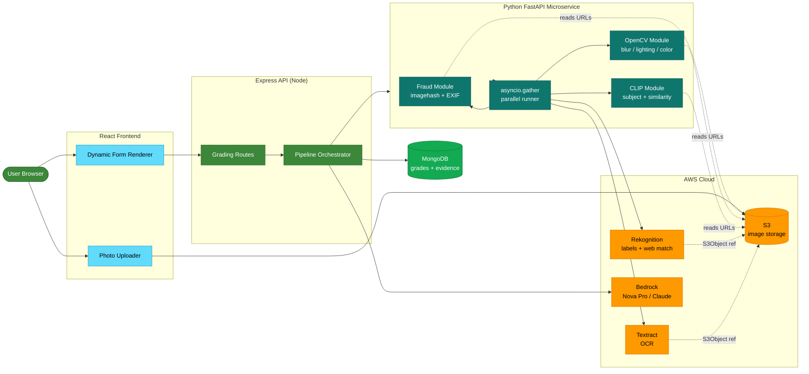
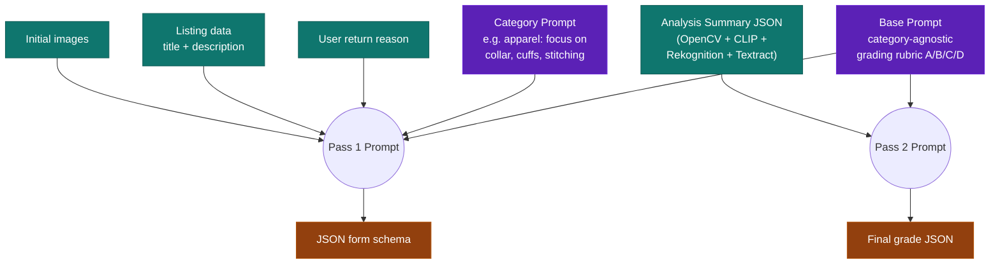

# AI Grading System — Full Pipeline Diagram

Source: [v1.43 Grading System Overview DOC.md](./v1.43%20Grading%20System%20Overview%20DOC.md)

---

## 1. Master Pipeline (End-to-End)

```mermaid
flowchart TD
    %% ============ ENTRY ============
    A([User opens return URL]) --> B[/"Submit return reason (text)<br/>+ optional initial images"/]

    %% ============ FRAUD CHECK ============
    B --> FC{{"FRAUD CHECK<br/><i>before any processing</i>"}}
    FC --> FC1["imagehash<br/>perceptual hash vs<br/>known catalog images"]
    FC --> FC2["Pillow / EXIF<br/>camera metadata check"]
    FC --> FC3["AWS Rekognition<br/>open-web reverse<br/>image match"]
    FC1 --> FCD{Flagged?}
    FC2 --> FCD
    FC3 --> FCD
    FCD -- "Yes" --> REJECT([Reject submission early<br/>save downstream cost])
    FCD -- "No" --> P1

    %% ============ BEDROCK PASS 1 ============
    subgraph PASS1["BEDROCK PASS 1 — Form Generator"]
        direction TB
        P1["Inputs<br/>• user reason<br/>• initial images<br/>• base prompt<br/>• category prompt<br/>• product listing data"]
        P1 --> P1CACHE{"Cache hit?<br/>key = hash(product_id +<br/>normalized_return_reason)"}
        P1CACHE -- "Yes" --> P1OUT
        P1CACHE -- "No" --> P1MODEL["Amazon Nova Pro<br/>or Claude 3.5 Sonnet<br/><i>(multimodal)</i>"]
        P1MODEL --> P1OUT["JSON form schema"]
    end

    P1OUT --> RENDER["Dynamic React form<br/>rendered to user"]

    %% ============ PROGRESSIVE FORM ============
    B -. "shown instantly<br/>(generic fields)" .-> PROG["Progressive form<br/>generic placeholders"]
    PROG -. "replaced on arrival<br/>(~3-5s)" .-> RENDER

    %% ============ PER-PHOTO VALIDATION ============
    RENDER --> UPLOAD["User uploads photos"]
    UPLOAD --> PV{{"PER-PHOTO VALIDATION<br/><i>real-time, as each image arrives</i>"}}
    PV --> PV1["OpenCV<br/>blur + lighting check"]
    PV --> PV2["CLIP<br/>subject match<br/>e.g. 'shows a tie collar?'"]
    PV1 --> PVD{Photo valid?}
    PV2 --> PVD
    PVD -- "No" --> PVFB[/"Instant feedback to user<br/>before form submission"/]
    PVFB --> UPLOAD
    PVD -- "Yes" --> SUBMIT([User submits completed form])

    %% ============ SPECIALIZED ANALYSIS (PARALLEL) ============
    SUBMIT --> SA{{"SPECIALIZED ANALYSIS<br/><i>asyncio.gather — parallel</i>"}}
    SA --> SA1["OpenCV<br/>• dominant color<br/>• visual histogram<br/>vs listing photo"]
    SA --> SA2["CLIP<br/>visual similarity score<br/>vs original listing"]
    SA --> SA3["AWS Rekognition<br/>defect / damage labels<br/>(Label Detection API)"]
    SA --> SA4["AWS Textract<br/>read serial #s,<br/>labels, tags"]

    SA1 --> ASSEMBLE["Assemble structured<br/>JSON summary"]
    SA2 --> ASSEMBLE
    SA3 --> ASSEMBLE
    SA4 --> ASSEMBLE

    %% ============ BEDROCK PASS 2 ============
    subgraph PASS2["BEDROCK PASS 2 — Grade Synthesizer"]
        direction TB
        P2IN["Input: structured JSON summary<br/><i>(NOT raw images)</i>"]
        P2IN --> P2MODEL["Amazon Nova Pro<br/>or Claude 3.5 Sonnet<br/><i>(text-only sufficient)</i>"]
        P2MODEL --> P2OUT["Final grade JSON<br/>• grade A/B/C/D<br/>• quality_score<br/>• confidence<br/>• defects[]<br/>• rationale"]
    end

    ASSEMBLE --> P2IN

    %% ============ POST-GRADE ROUTING ============
    P2OUT --> STORE[("MongoDB<br/>grade record +<br/>full evidence bundle")]
    STORE --> REVIEW{"confidence = low<br/>OR missing_evidence<br/>non-empty?"}
    REVIEW -- "Yes" --> HUMAN([Flag for human review])
    REVIEW -- "No" --> ROUTE([Smart Routing Engine])

    %% ============ STYLES ============
    classDef entry fill:#1e3a8a,stroke:#1e40af,color:#fff
    classDef fraud fill:#7f1d1d,stroke:#991b1b,color:#fff
    classDef bedrock fill:#5b21b6,stroke:#6d28d9,color:#fff
    classDef tool fill:#0f766e,stroke:#115e59,color:#fff
    classDef store fill:#92400e,stroke:#b45309,color:#fff
    classDef terminal fill:#374151,stroke:#1f2937,color:#fff

    class A,B,SUBMIT entry
    class FC,FC1,FC2,FC3,REJECT fraud
    class P1,P1MODEL,P1OUT,P2IN,P2MODEL,P2OUT bedrock
    class SA1,SA2,SA3,SA4,PV1,PV2 tool
    class STORE store
    class HUMAN,ROUTE,REJECT terminal
```

---

## 2. Service Architecture (Where Each Piece Runs)

---

## 3. Prompt Composition (Pass 1 + Pass 2)

---

## 4. Decision Gates Summary

| Gate | Stage | Outcome if YES | Outcome if NO |
|---|---|---|---|
| Fraud flagged | After Step 3 | Reject early, no LLM cost | Continue to Pass 1 |
| Pass 1 cache hit | Step 4 | Reuse schema, skip LLM | Call Bedrock Pass 1 |
| Photo valid | Step 6 (per upload) | Accept upload | Re-prompt user instantly |
| Confidence low / evidence missing | After Step 9 | Human review queue | Smart Routing Engine |
