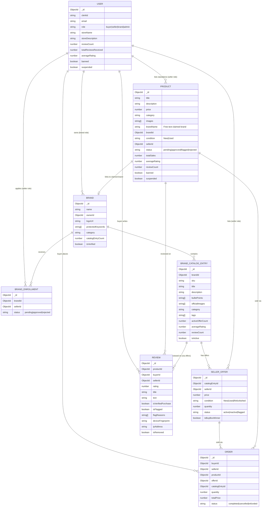

# Marketplace Platform: System Context & Architecture Summary

This document provides a comprehensive reference for the foundational architecture, database schemas, role authority model, and marketplace logic of this platform. It is intended as the core context document for any new feature layer built on top of this foundation.

---

## 🎯 Platform Overview

This is a **high-fidelity, simulated e-commerce marketplace** modeled after Amazon's third-party seller and ASIN catalog model. It is designed as a full-featured sandbox with a realistic role hierarchy, multi-seller catalog system, and moderation tooling — ready to support any application-layer features (analytics, AI/ML, automation, custom workflows, etc.) on top.

The platform supports two product listing models running in parallel:
1. **Catalog-based listings (ASIN model):** Brands register official product records. Sellers compete on those records with price-only offers. A Buy Box algorithm surfaces the cheapest active seller.
2. **Standalone listings:** Sellers create free-text product listings with their own title, images, description, and brand claim. These go through an admin moderation workflow.

---

## 🔑 Role Authority Matrix

The system supports five distinct user roles (`pending`, `buyer`, `seller`, `brand`, `admin`) enforced via RBAC middleware:

| Capability | Buyer | Seller | Brand Owner | Admin |
| :--- | :---: | :---: | :---: | :---: |
| Browse & Search Catalog / Products | ✅ | ✅ | ✅ | ✅ |
| View Product Detail / Catalog Pages | ✅ | ✅ | ✅ | ✅ |
| Place Orders (Simulated Checkout) | ✅ | ❌ | ❌ | ❌ |
| Write Reviews (on purchased/viewed items) | ✅ | ❌ | ❌ | ❌ |
| Create Standalone Listings | ❌ | ✅ | ❌ | ❌ |
| List Offers against Registered Catalog Entries | ❌ | ✅ | ❌ | ❌ |
| Register Brand Profile & Define Keywords | ❌ | ❌ | ✅ | ❌ |
| Register Brand Catalog Entries | ❌ | ❌ | ✅ | ❌ |
| Approve / Reject Seller Brand Enrollment Requests | ❌ | ❌ | ✅ | ❌ |
| View Enrolled Sellers' Stats | ❌ | ❌ | ✅ | ❌ |
| Moderate ALL Products, Reviews, and Sellers Platform-Wide | ❌ | ❌ | ❌ | ✅ |
| Access Flagged Items Feed & Central Analytics | ❌ | ❌ | ❌ | ✅ |

### Key Architectural Boundaries
- **Brand vs. Admin Visibility:** Brand Owners can view stats and catalog data only for sellers enrolled under their brand. Admins have complete visibility and moderation authority across all entities.
- **Reviews & Purchases:** Only `buyer` accounts can purchase products and write reviews. `isVerifiedPurchase` is computed automatically from order history.
- **Sellers:** Can monitor their own listing statuses and offer performance, but have no visibility into other sellers' data.

---

## 📊 Database Schemas & Data Relationships

All models are built using Mongoose. The structure decouples **official catalog content** (managed by brands) from **seller-specific offers** (managed by sellers), while keeping a **standalone product model** for free-form listings.

### Model Reference
1. **User Model:** [user.model.js](file:///c:/Dev/AI%20Powered%20Marketpllace%20Security/backend/src/modules/users/user.model.js)
   - Core authentication and profile. Denormalized rating stats (`reviewCount`, `totalReviewsReceived`, `averageRating`) are updated via post-save hooks to avoid joins during reads.
2. **Product Model (Standalone Listings):** [product.model.js](file:///c:/Dev/AI%20Powered%20Marketpllace%20Security/backend/src/modules/products/product.model.js)
   - Free-form product listings where sellers supply their own title, images, description, and brand name. Goes through admin moderation (`approved`, `flagged`, `rejected`).
3. **Brand Model:** [brand.model.js](file:///c:/Dev/AI%20Powered%20Marketpllace%20Security/backend/src/modules/brands/brand.model.js)
   - Registered brand profiles. Contains `protectedKeywords` for brand identity enforcement and `catalogEntryCount` denormalized for display.
4. **Brand Enrollment Model:** [brandEnrollment.model.js](file:///c:/Dev/AI%20Powered%20Marketpllace%20Security/backend/src/modules/brands/brandEnrollment.model.js)
   - Tracks seller applications to list under a brand. Compound unique index `{ brandId, sellerId }` prevents duplicate applications.
5. **Brand Catalog Entry Model:** [brandCatalogEntry.model.js](file:///c:/Dev/AI%20Powered%20Marketpllace%20Security/backend/src/modules/brandCatalog/brandCatalogEntry.model.js)
   - The authoritative product record for a brand (ASIN equivalent). Stores `officialImages`, `description`, `bulletPoints` as the canonical product specification.
6. **Seller Offer Model:** [sellerOffer.model.js](file:///c:/Dev/AI%20Powered%20Marketpllace%20Security/backend/src/modules/offers/sellerOffer.model.js)
   - Links sellers to catalog entries with a price and condition. Enforces one-offer-per-seller-per-entry via unique compound index. `isBuyBoxWinner` is recalculated on every offer change.
7. **Order Model:** [order.model.js](file:///c:/Dev/AI%20Powered%20Marketpllace%20Security/backend/src/modules/orders/order.model.js)
   - Simulated transactions. Supports two paths: **Catalog Path** (offer on a catalog entry) and **Standalone Path** (direct product purchase).
8. **Review Model:** [review.model.js](file:///c:/Dev/AI%20Powered%20Marketpllace%20Security/backend/src/modules/reviews/review.model.js)
   - Buyer reviews on products. Unique per `{ productId, buyerId }`. Stores `ipAddress` and `deviceFingerprint` for network-level analysis. `isVerifiedPurchase` is set by the order service.

---

## 🖥️ Frontend Architecture & Marketplace Flow

The frontend is built on **React (Vite)** with **TailwindCSS** and **shadcn/ui**. It follows an Amazon-inspired layout with a dark header, search, category navigation, and modular role-specific dashboards.

Route and layout configuration lives in [App.jsx](file:///c:/Dev/AI%20Powered%20Marketpllace%20Security/frontend/src/App.jsx).

### Key Pages
1. **Public Marketplace:**
   - **Home ([HomePage.jsx](file:///c:/Dev/AI%20Powered%20Marketpllace%20Security/frontend/src/pages/HomePage.jsx)):** Category tiles, featured product grid, search bar.
   - **Search Results ([SearchResultsPage.jsx](file:///c:/Dev/AI%20Powered%20Marketpllace%20Security/frontend/src/pages/SearchResultsPage.jsx)):** Dynamic filtering by category, price range, and rating. Combines catalog entries (via Buy Box offers) and standalone products in a single results stream.
   - **Catalog Entry Detail ([CatalogEntryDetailPage.jsx](file:///c:/Dev/AI%20Powered%20Marketpllace%20Security/frontend/src/pages/CatalogEntryDetailPage.jsx)):** Shows brand-owned product content. Lists all competing seller offers, highlights the Buy Box winner for one-click checkout.
   - **Standalone Product Detail ([ProductDetailPage.jsx](file:///c:/Dev/AI%20Powered%20Marketpllace%20Security/frontend/src/pages/ProductDetailPage.jsx)):** Seller-specific listing view with full description, images, reviews, and purchase flow.
2. **Dashboards:**
   - **Seller Central ([SellerDashboard.jsx](file:///c:/Dev/AI%20Powered%20Marketpllace%20Security/frontend/src/pages/SellerDashboard.jsx)):** Listing management, offer tracking (Buy Box status), brand enrollment requests.
   - **Brand Registry ([BrandDashboard.jsx](file:///c:/Dev/AI%20Powered%20Marketpllace%20Security/frontend/src/pages/brand/BrandDashboard.jsx)):** Enrollment approval, enrolled seller overview, product catalog management (CRUD on catalog entries).
   - **Admin Control Center ([AdminDashboard.jsx](file:///c:/Dev/AI%20Powered%20Marketpllace%20Security/frontend/src/pages/admin/AdminDashboard.jsx)):** Platform-wide moderation — product status overrides, seller bans/suspensions, review removal.

---

## 🛠️ Developer Toolkit

- **Seed Script ([seed.js](file:///c:/Dev/AI%20Powered%20Marketpllace%20Security/backend/seed.js)):** Populates the database with mock users (all roles), brands, catalog entries, seller offers, orders, and reviews for a realistic starting state.
- **DevTools Component ([DevTools.jsx](file:///c:/Dev/AI%20Powered%20Marketpllace%20Security/frontend/src/components/shared/DevTools.jsx)):** A floating frontend overlay for developers to trigger simulated scenarios and inspect state without going through the full UI flow.
