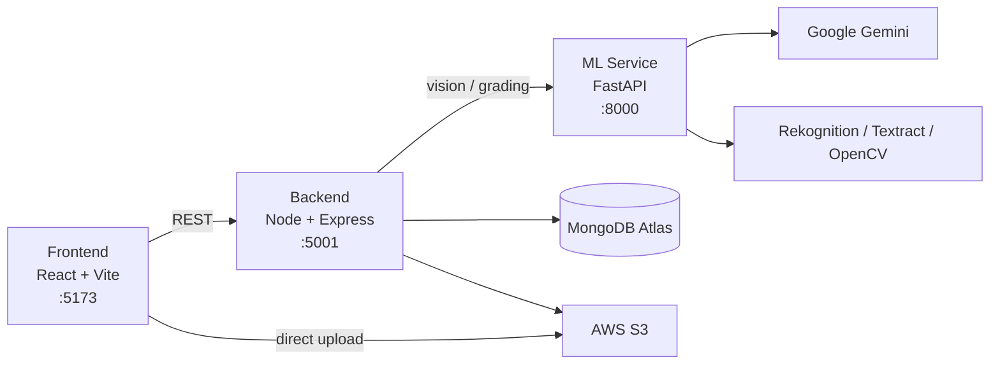

# Second-Life Marketplace — AI-Powered Reverse Commerce & Fraud Defence

An AI-powered extension to an e-commerce marketplace that turns **returns and used-item
listings** into recovered value, while defending against return fraud — using AI vision
grading, a trust model, geo-demand matching, and a deterministic disposition engine.

> **One line:** A returned or used item is graded from photos by AI, scored against the
> submitter's trust profile, matched to nearby buyers, and routed to the cheapest, smartest
> destination (peer handoff, best warehouse, donation, or liquidation) — then relisted as a
> grade-backed, honestly-priced product.

---

## Table of Contents

- [Architecture Overview](#architecture-overview)
- [Tech Stack](#tech-stack)
- [Repository Structure](#repository-structure)
- [Prerequisites](#prerequisites)
- [Quick Start](#quick-start)
- [Environment Variables](#environment-variables)
- [Seeding Demo Data](#seeding-demo-data)
- [Feature Phases](#feature-phases)
- [Key API Surface](#key-api-surface)
- [Testing](#testing)
- [Sustainability & Green Credits](#sustainability--green-credits)
- [Documentation](#documentation)

---

## Architecture Overview

The system runs as **three processes**: a React frontend, a Node/Express backend, and a Python
FastAPI ML service, backed by MongoDB Atlas, AWS (S3/Rekognition/Textract), and Google Gemini.



The core flow: **Intake (returns / sell-used) → AI Grading → Trust Scoring → Routing →
Resale**, with **Prevention** and **Festive Defense** layers acting before/around purchase.
See [`Meta/Solutions/UnifiedTechnicalDocumentation.md`](Meta/Solutions/UnifiedTechnicalDocumentation.md)
for the full breakdown and diagrams.

---

## Tech Stack

| Layer | Technology |
|---|---|
| Frontend | React 19, Vite, Tailwind, framer-motion, Clerk, axios |
| Backend | Node.js, Express, Mongoose, Clerk SDK, helmet |
| ML Service | Python, FastAPI, Uvicorn |
| Database | MongoDB Atlas (M0), `2dsphere` geo indexes |
| LLM | Google Gemini (`gemini-2.5-flash` + `-flash-lite` fallback) |
| Vision | AWS Rekognition, Textract, OpenCV, perceptual hashing |
| Storage | AWS S3 (browser direct upload via presigned URLs) |
| Auth | Clerk |
| Signing (optional) | AWS KMS / Ed25519 + `qrcode` (Health Card) |

---

## Repository Structure

```
.
├── backend/              # Node + Express API (module-per-domain)
│   ├── src/
│   │   ├── config/       # DB connection, index creation
│   │   ├── contracts/    # Frozen JSON data contracts
│   │   ├── middleware/   # auth, error handling
│   │   └── modules/      # returns, secondhand, items, grading, trust,
│   │                     # routing, demand, resale, prevention, festive, ...
│   ├── seed*.js          # Demo seed scripts
│   └── server.js         # App entry — route registration
├── ml-service/           # Python FastAPI vision/grading service
│   ├── app/              # main, routers, services, models
│   ├── trained_models/   # Drop-in .joblib artifacts (post-hackathon)
│   └── requirements.txt
├── frontend/             # React + Vite client
└── Meta/Solutions/       # Planning + unified technical documentation
```

---

## Prerequisites

- **Node.js** 18+ and npm
- **Python** 3.10+ and pip
- **MongoDB Atlas** cluster (or local MongoDB)
- **AWS account** with S3, Rekognition, Textract access
- **Google Gemini API key**
- **Clerk** application (publishable + secret keys)

---

## Quick Start

Clone, then set up each of the three services. Run them in **three separate terminals**.

### 1. Backend (port 5001)

```bash
cd backend
npm install
cp .env.example .env        # fill in real values (see below)
npm run dev                 # nodemon server.js
```

### 2. ML Service (port 8000)

```bash
cd ml-service
python -m venv .venv
.venv\Scripts\activate      # Windows (use: source .venv/bin/activate on macOS/Linux)
pip install -r requirements.txt
cp .env.example .env        # fill in AWS + Gemini values
uvicorn app.main:app --reload --port 8000
```

### 3. Frontend (port 5173)

```bash
cd frontend
npm install
# create frontend/.env with: VITE_API_URL=http://localhost:5001/api
npm run dev
```

Verify everything is connected:
- Backend health: `GET http://localhost:5001/api/health` → `{ "status": "OK" }`
- ML health: `GET http://localhost:8000/health` → `{ "service": "ml-service", "status": "ok" }`
- Frontend: `http://localhost:5173`

---

## Environment Variables

A root [`.env.example`](.env.example) documents every variable. Copy the relevant blocks into
`backend/.env` and `ml-service/.env`.

### Backend (`backend/.env`)

| Variable | Description |
|---|---|
| `PORT` | Backend port (default 5001) |
| `MONGODB_URI` | MongoDB Atlas connection string |
| `NODE_ENV` | `development` / `production` |
| `CLERK_PUBLISHABLE_KEY`, `CLERK_SECRET_KEY`, `CLERK_WEBHOOK_SECRET` | Clerk auth |
| `AWS_REGION`, `AWS_ACCESS_KEY_ID`, `AWS_SECRET_ACCESS_KEY` | AWS credentials |
| `S3_BUCKET_NAME`, `S3_UPLOAD_PREFIX` | Evidence photo storage |
| `GEMINI_API_KEY`, `GEMINI_MODEL_PRIMARY`, `GEMINI_MODEL_FALLBACK` | LLM provider |
| `KMS_KEY_ID`, `PUBLIC_KEY_ED25519` | Optional Health Card signing |
| `ML_SERVICE_URL` | URL of the FastAPI service (default `http://localhost:8000`) |
| `UPLOAD_MAX_SIZE_MB`, `GRADE_CACHE_TTL_SECONDS` | App config |

### Frontend (`frontend/.env`)

| Variable | Description |
|---|---|
| `VITE_API_URL` | Backend API base (e.g. `http://localhost:5001/api`) |
| `VITE_CLERK_PUBLISHABLE_KEY` | Clerk publishable key |

> ⚠️ `.env` files are git-ignored. Never commit real credentials. Use exact/pinned values.

---

## Seeding Demo Data

The backend ships idempotent seed scripts for a reproducible demo:

```bash
cd backend
node src/config/createIndexes.js   # create Atlas indexes (run once)
npm run seed                       # base marketplace data
npm run seed:trust                 # trust-tier personas
npm run seed:prevention            # return-insight SKUs
npm run seed:festive               # festive calendar events
npm run prevention:recompute       # build the Return Insights Knowledge Base
```

---

## Feature Phases

| Phase | Feature | Summary |
|---|---|---|
| **P0** | Foundation | AWS, env, Atlas indexes, module scaffolding, data contracts, S3 presign |
| **P1** | Dual Intake | Returns + Sell-Used converge into one `Item` + append-only lifecycle log |
| **P2** | AI Grading | Gemini dynamic claim-specific form → per-field inspection → A–D grade |
| **P3** | Trust & Fraud | Per-user trust profile (tier + score), fraud clamps, pattern detectors |
| **P4–6** | Routing / Demand / Resale | Disposition brain, geo-demand matching, grade-backed storefront |
| **P7** | Prevention Intelligence | Closed-loop pre-purchase return prevention (silent penalties) |
| **P7.5** | Festive Defense | Calendar-aware policy levers (return window, COD gate, cancel lock) |
| **P8** | Sustainability & Green Credits | Environmental impact tracking, donation flows, green credit rewards & redemption |
| **X** | Developer Logs | Real-time, plain-English pipeline observability sidebar |

---

## Key API Surface

All routes are mounted under `/api`. Selected highlights:

| Method | Path | Purpose |
|---|---|---|
| GET | `/api/health` | Backend health check |
| POST | `/api/uploads/presign` | Get an S3 presigned upload URL |
| POST | `/api/returns` | Initiate a return |
| POST | `/api/secondhand/from-order` | List a used item from a past order |
| GET | `/api/items/:itemId` | Item + lifecycle events |
| GET | `/api/items/:itemId/logs` | Developer logs (live sidebar) |
| POST/GET | `/api/grading/form/:itemId` | Dynamic evidence form (Pass 1) |
| POST | `/api/grading/verify-field` | Per-field batched inspection |
| GET | `/api/trust/:userId` | Trust profile (lazy recompute) |
| POST | `/api/routing/compute` | Run the disposition engine |
| GET | `/api/demand/map?term=shoe` | Admin demand map data |
| GET | `/api/resale` | Resale storefront |
| GET | `/api/prevention/product/:productId` | PDP fit/compat hint |
| POST | `/api/prevention/checkout-risk` | Silent checkout risk scoring |
| GET | `/api/festive/active` | Active festive event + policy |
| GET | `/api/sustainability/user/:userId` | User's environmental impact & credit balance |
| GET | `/api/sustainability/platform` | Platform-wide CO2/water savings totals |
| GET | `/api/sustainability/item/:itemId` | Per-item sustainability impact |
| POST | `/api/sustainability/donate/:itemId` | Trigger donation flow with NGO matching |
| GET | `/api/sustainability/receipt/:itemId` | Download donation tax receipt PDF |
| POST | `/api/sustainability/redeem` | Redeem green credits for checkout discount |

---

## Sustainability & Green Credits

**Phase 8** introduces environmental impact tracking and a circular economy incentive system that rewards users for sustainable actions while quantifying the platform's positive environmental footprint.

### Overview

The sustainability module tracks CO2 and water savings from diverting items from landfill through resale and donation, awards users with "green credits" for sustainable actions, and provides transparency through impact summaries and tax-deductible donation receipts.

### Key Components

#### 1. Environmental Impact Calculation

Each item disposition (resale sale, donation, liquidation) is evaluated against **category-specific manufacturing footprints** to calculate displaced emissions:

| Category | CO2 per Item (kg) | Water per Item (L) | Source |
|---|---|---|---|
| Clothing | 20.0 | 2,700 | WRAP / INTEXTER textile LCA |
| Footwear | 14.0 | 8,000 | Quantis World Apparel & Footwear LCA 2018 |
| Electronics | 30.0 | 500 | Apple/Dell product carbon reports |
| Furniture | 40.0 | 200 | EU JRC furniture LCA estimates |
| Books | 2.5 | 50 | Carbon Trust paper/print estimates |

**Diversion factors** scale the impact by disposition type:
- **Resale / Donation**: 1.0 (full displacement of new manufacture)
- **Liquidation**: 0.1 (partial recovery)

Impact is computed **once per item** (idempotent) and stored in the `SustainabilityImpact` collection.

#### 2. Green Credit System

Users earn credits for circular actions and redeem them as checkout discounts:

| Action | Credits Earned | Redemption Value |
|---|---|---|
| Buy a resale item | 10 | 1 credit = ₹10 discount |
| Sell a resale item (seller) | 10 | Max redemption: unlimited |
| Donate an item | 25 | Credits never expire |

Credits are tracked in an **append-only ledger** (`GreenCreditLedger`) with balance snapshots for instant retrieval. Redemptions are recorded as negative deltas.

#### 3. Donation Flow

When a user donates an item:

1. **NGO Matching**: Uses MongoDB `$geoNear` to find the nearest active NGO that accepts the item's category
2. **Impact Recording**: Calculates CO2/water savings and awards 25 green credits
3. **Receipt Generation**: Creates a signed PDF tax receipt using `pdfkit` with:
   - Estimated fair-market value (50% of original product price)
   - NGO details (name, city, contact)
   - Cryptographic signature (SHA-256 placeholder; Ed25519/KMS signature pending)
4. **Lifecycle Update**: Moves item to `DONATED` status and unlists any active resale listings

Receipts are downloadable via `/api/sustainability/receipt/:itemId`.

#### 4. NGO Directory

The `Ngo` model maintains a geo-indexed directory of charitable organizations:
- **Coordinates**: GeoJSON `Point` with `2dsphere` index for proximity search
- **Category Filters**: NGOs specify accepted categories (or accept all)
- **Active Flag**: Enables/disables availability in matching
- **Seed Data**: Demo NGOs across Indian cities (Raipur, Mumbai, Bangalore, etc.)

Fallback: If no geo-match is found, returns any active NGO.

#### 5. Resale Sale Integration

When a resale item is purchased (via `order.service`):
- **Buyer**: Receives 10 credits + impact attribution
- **Seller**: Receives 10 credits
- **Item Lifecycle**: Moves to `SOLD` status
- **Listing Status**: Updated to `SOLD`

Impact is **single-attributed** to the buyer (beneficiary) but both parties earn credits.

### API Examples

#### Get User Impact Summary
```bash
GET /api/sustainability/user/:userId
```
Returns:
```json
{
  "totalCo2Kg": 48.5,
  "totalWaterL": 13200,
  "creditBalance": 65,
  "itemCount": 3,
  "recentLedger": [ ... ]
}
```

#### Donate an Item
```bash
POST /api/sustainability/donate/:itemId
Body: { "lng": 81.6296, "lat": 21.2514 }  # optional donor location
```
Returns NGO match, impact data, credits earned, receipt URL.

#### Redeem Credits at Checkout
```bash
POST /api/sustainability/redeem
Body: { "amount": 5, "orderId": "..." }
```
Returns: `{ "discount": 50, "creditsSpent": 5, "balanceAfter": 60 }`

#### Platform Impact (Admin/Public)
```bash
GET /api/sustainability/platform
```
Returns aggregate CO2/water savings and total credits issued across all users.

### Seeding Demo Data

```bash
cd backend
npm run seed:sustainability    # Seeds NGO directory with 2dsphere geo index
node seed-phase8-demo.js       # Creates demo buyer with items + impacts
npm run smoke:sustainability   # End-to-end service logic smoke test
```

### Future Enhancements (TODO)

- **KMS Signing**: Replace SHA-256 receipt signatures with AWS KMS Ed25519 signing
- **LCA Audits**: Source category factors from third-party audited lifecycle assessments
- **Blockchain Registry**: Optional immutable impact ledger for corporate ESG reporting
- **Carbon Offsets**: Partner with verified offset projects for credit-to-offset conversion
- **Impact Badges**: User profile badges for sustainability milestones (e.g., "100 kg CO2 saved")

---

## Testing

```bash
# Backend — trust scoring unit tests
cd backend
npm run test:trust

# Festive smoke test
npm run smoke:festive

# Sustainability smoke test
npm run smoke:sustainability

# ML service
cd ml-service
pytest
```

---

## Documentation

| Document | Description |
|---|---|
| [`Meta/Solutions/UnifiedTechnicalDocumentation.md`](Meta/Solutions/UnifiedTechnicalDocumentation.md) | Full system architecture, data flows, Mermaid diagrams |
| [`Meta/Solutions/System-Overview-PlainEnglish.md`](Meta/Solutions/System-Overview-PlainEnglish.md) | Non-technical plain-English overview |
| [`Meta/Solutions/Phases/`](Meta/Solutions/Phases/) | Per-phase planning and implementation docs |
| [`ml-service/README.md`](ml-service/README.md) | ML service specifics |

---

## Notes & Disclaimers

- Physical logistics (courier scheduling, warehouse capacity, the hold-at-home timer) are
  **simulated as state changes** — the system demonstrates the decision intelligence, not a
  live fulfilment integration.
- Payments are mocked; the meaningful fraud signal is the **refund hold**, not real disbursement.
- See the TODO register in the unified docs for deferred/stretch items.
